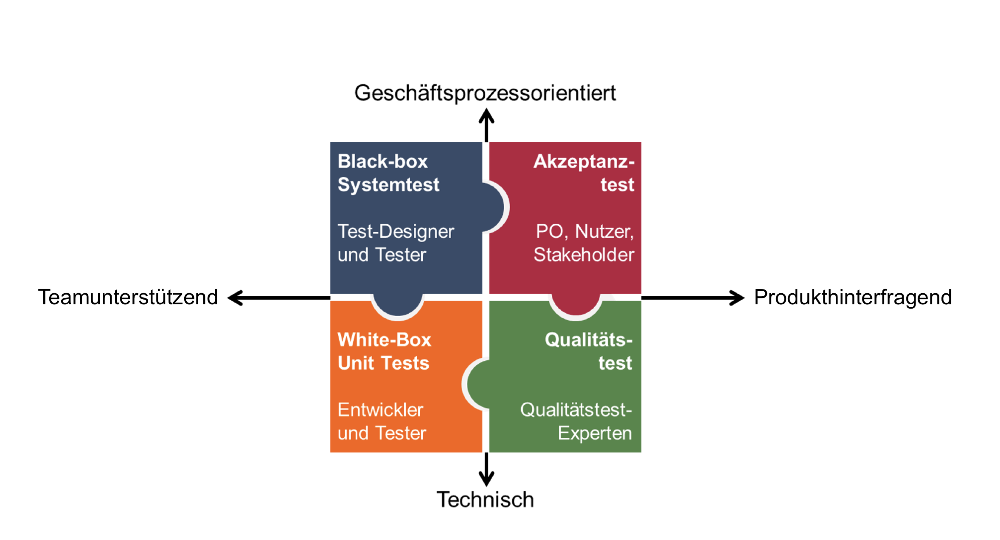
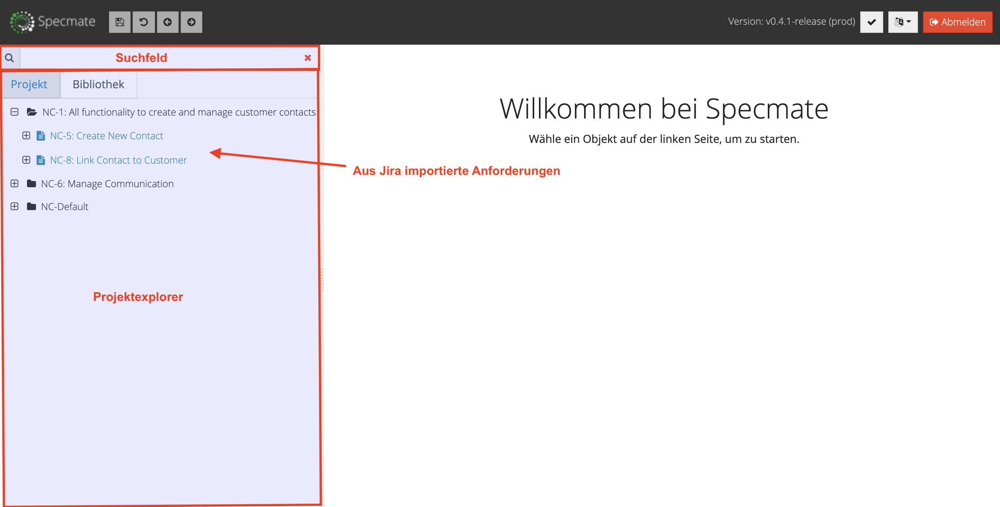
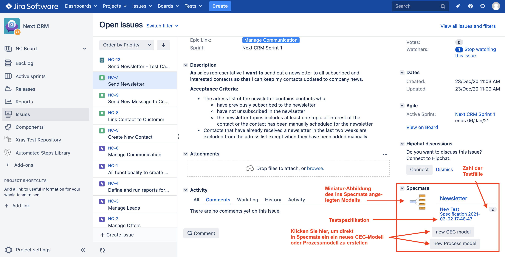
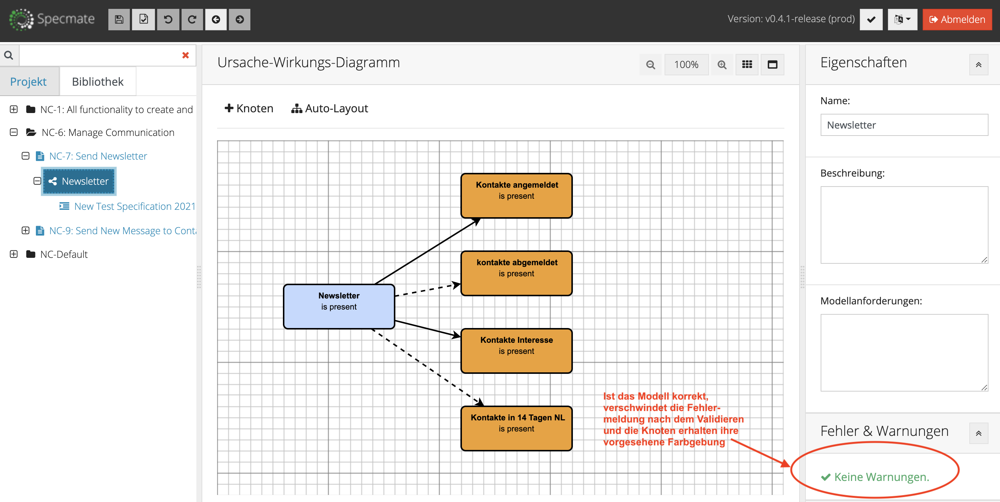
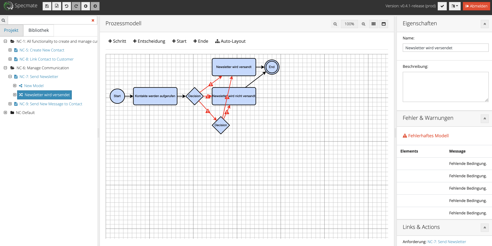
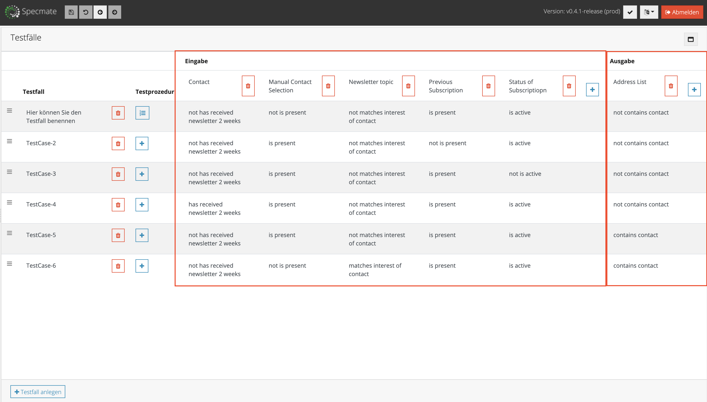

## Inhalt

- [Einleitung und Überblick](#EinleitungundÜberblick)
	- [Konfiguration](##Konfiguration)
	- [Was ist Specmate?](##WasistSpecmate?)
	- [Nutzung von Specmate innerhalb von Jira-Projekten](##NutzungvonSpecmateinnerhalbvonJira-Projekten)
	- [Ansichten und Übersichten in Specmate](##AnsichtenundÜbersichteninSpecmate)
		- [Anforderungsübersicht](###Anforderungsübersicht)
			- [Bibliotheksansicht](###Bibliotheksansicht)
				- [Suche](###Suche)
				- [Eigenschaften](###Eigenschaften)
					- [Links & Actions](####Links&Actions)
	- [Modellerstellung](##Modellerstellung)
		- [Wie entscheiden Sie, welches Modell zu erstellen ist?](###WieentscheidenSie,welchesModellzuerstellenist?)
		- [Die Editoren](###DieEditoren)
			- [CEG-Editor](####CEG-Editor)
			- [Prozessmodell-Editor](####Prozessmodell-Editor)
- [Testspezifikationen](#Testspezifikationen)
	- [Testspezifikation aus CEG-Modellen](##TestspezifikationausCEG-Modellen)
	- [Testspezifikation aus Prozessmodellen](##TestspezifikationausProzessmodellen)
	- [Export von Testspezifikationen und -prozeduren](##ExportvonTestspezifikationenund-prozeduren)

# Einleitung und Überblick

Im Folgenden erfahren Sie, wie Sie Sepcmate für Ihre Jira-Projekte nutzen können. Wenn Sie ausführlichere Informationen zu einzelnen Themen wünschen, klicken Sie auf die angegebenen Links und lesen Sie die entsprechenden Abschnitte in der [Specmate Dokumentation](https://github.com/qualicen/specmate/blob/dokumentation_Julia/documentation/index_JuliasVersion.md) nach.

## Was ist Specmate?

Specmate unterstützt Sie im Design von Tests aus Ihren Anforderungen und importiert Ihre Anforderungen aus verschiedenen Quellen wie z.B. Atlassian Jira. Sind die Anforderungen importiert, können Sie in einem ersten Schritt die Anforderungen in einem leichtgewichtigen Modell beschreiben. Specmate unterstützt Ursache-Wirkungs-Diagramme (engl. Cause-Effect-Graphs, CEGs) und Prozessdiagramme (ähnlich einem Aktivitätsdiagramm).

CEGs eignen sich besonders zur Beschreibung für Anforderungen in der Form "Wenn... dann ..." und somit z.B. zur Beschreibung von  Geschäftsregeln. Prozessdiagramme eignen sich besonders zur Beschreibung von Geschäftsprozessen und sind daher vor allem für End-to-End-Tests geeignet.

Specmate ist vielfach einsetzbar und richtet sich an unterschiedliche Zielgruppen: Sie können Specmate sowohl in einem klassichen, sequenziellen als auch in einem agilen Entwicklungsprozess nutzen. Außerdem können Sie mit Specmate Test-Designs für verschiedene Test-Stufen durchführen.

## Konfiguration

DAS MÜSSTE JMD. ANDERES SCHREIBEN!

## Nutzung von Specmate innerhalb von Jira-Projekten

Wenn Sie Specmate für Ihr Jira-Projekt verwenden wollen,
loggen Sie sich bei Jira ein. Unten rechts auf Ihrer Projekt-Seite
sehen Sie Specmate und ein Dropdown-Menü. Wenn Sie auf dieses
klicken, erscheint ein Link zur Anmeldung bei Specmate via Jira.

Melden Sie sich bei Specmate mit Ihren Zugangsdaten für Jira an
und wählen Sie beim Dropdown-Menü "Projekt" Ihr Jira-Projekt aus,
für das Specmate verwendet wird.

Nachdem Sie sich bei Specmate angemeldet haben, sehen Sie diese Ansicht:

Wenn Sie Specmate von Jira aus verwenden, können Sie nicht nur
Specmate nutzen, um Ihr Projekt zu verbessern, sondern auch Ihre
Anforderungen direkt aus Jira importieren. Nachdem Sie sich bei
Specmate über Jira angemeldet haben, sehen Sie auf der linken
Seite im *Projektexplorer* Ihre in Jira angelegten Issues: Die Ordner repräsentieren in der Standard-Konfiguration die in Jira gespeicherten Epics, Ihre Stories und Tests sind sind in der Standardkonfiguration in den Ordnern als Anforderungen gespeichert. Falls Sie eine andere Konfiguration bevorzugen, wenden Sie sich an Ihre_n Jira-Administrator_in.

Nachdem Sie ein Modell in Specmate erstellt haben (Genaueres
dazu erfahren Sie im Verlauf dieser Anleitung!), können Sie in
dem von Ihnen geöffneten Jira-Issue die erstellten Modelle inkl.
kleiner Vorschau-Bilder im Abschnitt "Specmate" sehen. Hier werden
Ihnen außerdem bereits angelegte Testspezifikationen angezeigt
und auch wieviele Testfälle diese je enthalten. Wenn Sie auf das kleine Modell-Bild klicken, gelangen Sie direkt zu Ihrem in Specmate angelegten Modell. Klicken Sie auf die grau hinterlegten Schaltflächen, gelangen Sie in den Modelleditor von Specmate und können hier wahlweise ein neues CEG oder Prozessmodell erstellen. Durch Anklicken der in Jira angezeigten Testspezifikation gelangen Sie zu dieser. Wenn Sie auf die grau hinterlegte Zahl (sie verrät die Anzahl der Testfälle) klicken, gelangen Sie zu den in Specmate gespeicherten Testfällen.

Mittels der zwei grauen Buttons können Sie direkt von Jira aus
ein neues CEG- oder Prozessmodell anlegen.

## Ansichten und Übersichten in Specmate

### Anforderungsübersicht

Haben Sie auf Basis Ihrer Anforderungen eine Modellart ausgewählt, klicken Sie links im *Projektexplorer* auf eine dem Modell zugrunde liegende Anforderung: So gelangen Sie zur Anforderungsübersicht, die folgendermaßen aussieht:

Wenn Sie hier nach unten scrollen, ergeben sich für Sie mehrere Optionen:

1. Sie können Ihre aus Jira verwendete Anforderungsquelle ansehen.
2. Sie können ein neues Ursache-Wirkungs-Diagramm (CEG) anlegen. Sie gelangen, wenn Sie den Namen Ihres geplanten Modells eingegeben und auf den "Modell anlegen-Button" geklickt haben, zum CEG-Modelleditor. Weiteres dazu finden Sie [hier](###CEG-Modelleditor).
3. Sie können ein bereits vorhandenes Modell, das Sie kopiert haben, einfügen.
4. Sie haben die Möglichkeit Ihre Modellanforderungen auszuformulieren.
5. Sie können  ein neues Prozessmodell anlegen: Sie gelangen, wenn Sie den Namen Ihres geplanten Modells eingegeben und auf den "Modell anlegen-Button" geklickt haben, zum Prozessmodell-Editor. Weiteres dazu finden Sie [hier](###Prozessmodell-Editor).
6. Sie können  eine neue [Testspezifikation](#Testspezifikationen) manuell anlegen oder…
7. …eine vorhandene Testspezifikation duplizieren.
9. Durch das Klicken auf das rote Papierkorbsymbol können Sie einzelne Elemente jederzeit löschen.
10. Durch das Klicken der "Kopieren-Schaltfläche" können Sie Modelle kopieren und wieder einfügen oder in der [Bibliotheksansicht](###Bibliotheksansicht) speichern.

### Bibliotheksansicht

Die Bibliothek ist Ihr "Baukasten" für Modelle. Hier können Sie Modelle oder Teile von Modellen, welche Sie häufig verwenden, speichern. Durch [Copy & Paste](#copy-and-paste) können Sie diese Bausteine kopieren und in anderen Modellen einfügen.

Sie können beliebig viele Ordner, Unterordner, Unter-Unterordner usw. in der Bibliotheksansicht anlegen und auch wieder löschen. Klicken Sie hierzu auf die von der obigen Abbildung gezeigten Schaltflächen. Genau so können Sie CEGs, Prozessmodelle und Testspezifikationen hier abspeichern. Wie oben bereits beschrieben ist es hier auch möglich nur Teile von komplexeren Modellen, die häufiger verwendet werden, zu speichern.

### Suche

- Specmate zeigt erst dann passende Suchergebnisse, wenn Sie mindestens zwei Zeichen in das Suchfeld eingegeben haben.
- Es werden nur Suchergebnisse aus dem Projekt angezeigt, in das Sie eingeloggt sind.
- Anforderungen oder Testprozeduren werden angezeigt, wenn der Suchbegriff als Präfix im Namen, in der Beschreibung oder der ID der Anforderung oder Testprozedur vorkommt (ab zwei Zeichen).
- Specmate unterstützt auch *Wildcard-Suchen*, nämlich
	- die Wildcard-Suche mit "\*": dabei findet die Suche alle Begriffe die durch das Ersetzen von "\*" mit keinem oder mehreren Zeichen entstehen. Der Suchbegriff "B\*äche" findet also Begriffe wie "Bäche" oder "Bedienoberfläche".
	- die Einzelzeichen-Wildcard-Suche mit "?":  die Suche findet dabei zum Beispiel bei der Eingabe "te?t", die Begriffe "test" und "text".
	- Die Symbole "\*" und "?" können allerdings nicht am Anfang eines Suchbegriffs eingesetzt werden.

### Eigenschaften

Auf der rechten Seite des Editors können Sie die *Eigenschaften*,
wie zum Beispiel Namen oder Beschreibungen des Modells und einzelner Knoten und Verbindungen, einsehen und ändern.

#### Links & Actions

Im Abschnitt *Links & Actions* können Sie die Beschreibung der Anforderung ansehen, für die Sie gerade ein Modell anlegen. Links zu bereits generierten Testspezifikationen werden ebenfalls angezeigt. Testspezifikationen und -prozeduren können hier exportiert werden.

## Modellerstellung

### Wie entscheiden Sie, welches Modell zu erstellen ist?

Für das Modellieren von Anforderungen haben Sie die Wahl zwischen
[Ursache-Wirkungs-Diagrammen (CEG)](####CEG-Modelleditor) und [Prozessmodellen](####Prozessmodell-Editor). Je nachdem, ob die Art der Anforderung…

- …regelbasiert ("Wenn dies und das, dann das Folgende... mit Ausnahme von ... dann...") ist oder
- …prozessbasiert ("Zuerst gibt der Benutzer A ein.  Aufgrund der Eingabe gibt das System entweder B oder C ein. Danach fragt das System den Benutzer nach D, danach...") ist,

können Sie die entsprechende Modellierungstechnik auswählen. Bei der Modellierung regelbasierter Anforderungen werden Ursache-Wirkungs-Diagramme verwendet, während prozessbasierte Anforderungen mit Prozessmodellen dargestellt werden können.

### Die Editoren

Es gibt zwei verschiedene Wege, um in den CEG-Modelleditor oder in den Prozessmodell-Editor zu gelangen:

1.) Sie klicken in Jira im Abschnitt Specmate – Voraussetzung dafür ist, dass Sie sich bereits auf der mit Jira verbundenen Specmate-Seite angemeldet haben, auf der rechten Seite auf eine der beiden Schaltflächen "new CEG model" oder "new Process model":

2.) Wenn Sie innerhalb der Anforderungsübersicht im Abschnitt "Ursache-Wirkungs-Modelle" oder im Abschnitt "Prozessmodelle" einen Namen für das von Ihnen geplante Modell eingegeben haben und auf die Schaltfläche "Modell anlegen" geklickt haben, gelangen Sie in den CEG-Modell-Editor oder in den Prozess-Modell-Editor.

Beide Editoren verfügen über eine identische Navigationsleiste, die sich oberhalb des Editors befindet:

Durch Anklicken der Schaltflächen in der Navigationsleiste können Sie in beiden Modell-Editoren…

1. …Ihr Modell speichern.
2. …Ihr Modell Validieren: Vorher angezeigte Fehlermeldungen (a) verschwinden dadurch eventuell (b), sonst wird anhand von dreieckig gerahmten Ausrufezeichen der Fehler lokalisiert (c): Wenn Sie mit dem Cursor über diese Warnzeichen navigieren, zeigt Specmate Ihnen die Ursache der Fehlermeldung an.

a) Angezeigte Fehlermeldung bei einem unvalidierten Modell

b) Keine Fehlermeldung bei korrekten Modell nach Validierung

c) konkrete Fehlerursachen werden lokal angezeigt

3. und 4.: …einzelne Schritte rückgängig machen oder wiederholen
5. und 6.:…zurück und vorwärts navigieren

#### CEG-Editor

Im CEG-Editor bietet Ihnen Specmate folgende Aktions- und Informationsmöglichkeiten, wobei die Aktionen 3.-5. genauso für den Prozessmodell-Editor gelten:

1. [Knoten](https://github.com/qualicen/specmate/blob/dokumentation_Julia/documentation/index_JuliasVersion.md#1-knoten) erstellen:
Bewegen Sie einfach den Cursor über das Knoten-Werkzeug und ziehen Sie ihn per drag & drop, bis sich der Knoten an der von Ihnen gewünschten Stelle im Editorfenster befindet. Durch einen Doppelklick auf den Knoten können Sie diesen benennen. Wenn Sie Ihren Cursor über den Knoten bewegen, erscheint ein grau umrandeter Pfeil innerhalb des Knotens. Ziehen Sie diesen zu einem anderen Knoten, um eine [Verbindung](https://github.com/qualicen/specmate/blob/dokumentation_Julia/documentation/index_JuliasVersion.md#5-verbindungen-erstellen) zwischen zwei Knoten herzustellen. Nach dem [Validieren](https://github.com/qualicen/specmate/blob/dokumentation_Julia/documentation/index_JuliasVersion.md#validieren) eines Modells sehen Sie drei verschiedenfarbige [Knotenarten](https://github.com/qualicen/specmate/blob/dokumentation_Julia/documentation/index_JuliasVersion.md#knoten-arten-und-bedingungen): Startknoten, Start- und Zielknoten und Zielknoten. Außerdem können Sie bei Zielknoten entscheiden, ob es sich um einen AND- oder OR-Typ handelt.
2. Auto-Layout: Klicken Sie auf Auto-Layout, werden die Knoten Ihres Modells bündig angeordnet.
3. Größe des Editors anpassen
4. Gitter ein- und ausblenden
5. Editorbereich maximieren
6. Informationen über das Modell einsehen
7. Fehlermeldungen werden angezeigt. Siehe dazu auch den 2. Punkt im Abschnitt [Die Editoren](###DieEditoren).

Wenn Sie noch mehr über die Möglichkeiten, die der CEG-Editor von Specmate Ihnen bietet, wissen wollen, lesen Sie [hier](https://github.com/qualicen/specmate/blob/dokumentation_Julia/documentation/index_JuliasVersion.md#erweiterte-funktionen-und-erl%C3%A4uterungen-zum-ursache-wirkungs-diagramm) weiter.

#### Prozessmodell-Editor

Der Prozessmodell-Editor funktioniert ähnlich wie der CEG-Editor:

Anstatt dass man oben links "Knoten" auswählen und in den Modellierungsbereich ziehen kann, gibt es noch differenziertere Möglichkeiten bei den Werkzeugen: Im Prozessmodell muss ein Anfangspunkt (+START) und ein Endpunkt (+ENDE) gewählt werden. Näheres dazu, finden Sie auch [hier](https://github.com/qualicen/specmate/blob/dokumentation_Julia/documentation/index_JuliasVersion.md#startende). (Die Knoten dazwischen werden hier als Schritte bezeichnet und können über das Werkzeug +SCHRITT in den Modellierungsbereich gezogen werden. [Hier](https://github.com/qualicen/specmate/blob/dokumentation_Julia/documentation/index_JuliasVersion.md#schritt) finden Sie noch mehr dazu.) Außerdem gibt es noch das Werkzeug +ENTSCHEIDUNG, das eine Aufspaltung im Prozess visualisiert – Weiteres zur Entscheidung finden Sie [hier](https://github.com/qualicen/specmate/blob/dokumentation_Julia/documentation/index_JuliasVersion.md#entscheidung). Die Auto-Layout-Funktion kann auch im Prozessmodell-Editor durch Anklicken des kleinen Strukturbaums verwendet werden.

# Testspezifikationen

Sie haben die Möglichkeit eine Testfall-Spezifikation manuell zu erstellen oder automatisch aus einem Modell zu generieren.

 Anhand des Symbols der Spezifikation im Projekt-Explorer können Sie sehen, ob sie automatisch oder manuell generiert wird.

Automatisch generiert: 

Manuell erstellt: 

Der Name der Testfall-Spezifikation basiert auf dem Datum und der Uhrzeit, zu der die Spezifikation angelegt wurde. Sie haben die Möglichkeit den Namen der Spezifikation zu ändern und eine Beschreibung hinzuzufügen.

## Testspezifikation aus CEG-Modellen

Die Spezifikation besteht aus mehreren Testfällen, wobei jeder Testfall eine bestimmte Konfiguration hat. Ein Testfall weist jeder Variable einen Wert zu. In bestimmten Testfällen lässt Specmate den Wert einer Variable frei. Ist dies der Fall, ist die Variable nicht auf einen bestimmten Wert beschränkt. Für die Erstellung der Spezifikation werden Regeln verwendet, um ein optimales Verhältnis zwischen Testabdeckung und Anzahl der Testfälle sicherzustellen. Dadurch wird verhindert, dass die Anzahl der Testfälle bei einem Zuwachs der Ursachen exponentiell wächst.

Die Knoten, die sich in der Spalte *Eingabe* befinden, sind Variablen, die die Ursachen aus dem Modell darstellen. Das sind alle Knoten, die keine eingehenden Verbindungen haben.
Unterhalb der Spalte *Ausgabe* finden Sie die Variablen, die die Wirkungen darstellen. Das sind alle Knoten, die keine ausgehenden Verbindungen haben. Sie können auch manuell weitere Ein- und Ausgabevariablen hinzufügen oder bestehende löschen.

Sie können einen Testfall auch löschen, wenn Sie auf das Papierkorbsymbol des jeweiligen Testfalls klicken. Wenn Sie Testfälle manuell hinzufügen möchten, können Sie die Schaltfläche *Testfall anlegen* im unteren Bereich drücken. Die Reihenfolge der Testfälle kann per Drag & Drop geändert werden.

Die Regeln zur Erzeugung von Testspezifikationen können Sie [hier](https://github.com/qualicen/specmate/blob/dokumentation_Julia/documentation/index_JuliasVersion.md#regeln-zur-erzeugung-von-testspezifikationen) ausführlicher nachlesen.

## Testspezifikation aus Prozessmodellen

Die Spezifikation besteht aus mehreren Testfällen, wobei jeder Testfall eine bestimmte Konfiguration hat. Ein Testfall weist jedem Entscheidungsknoten eine der verfügbaren Entscheidungen zu und setzt diese Entscheidung dann entsprechend auf *true*.
Für die Erstellung der Spezifikation werden Regeln verwendet, um ein optimales Verhältnis zwischen Testabdeckung und Anzahl der Testfälle sicherzustellen. Auch hier können Sie weitere Testfälle oder Entscheidungen hinzufügen oder vorhandene löschen. Sie können die Reihenfolge der Testfälle per Drag & Drop verschieben.

# Testprozedur

Für jeden Testfall können Sie eine Testprozedur anlegen. Hier können Sie alle notwendigen Schritte für den jeweiligen Testfall definieren. Bei der Modellierung eines CEGs muss die Testprozedur manuell hinzugefügt werden. Das Erzeugen einer Testfall-Spezifikation aus einem Prozessdiagramm führt zu automatisch erstellten Testprozeduren.

Sie können die bereits automatisch erstellte Testprozedur (Prozessdiagramm) ansehen, indem Sie auf das blaue Kästchen mit nummerierter Aufzählung klicken, wie auf der folgenden Abbildung ersichtlich:

Klicken Sie bei einem CEG auf dieses Kästchen, können Sie hier Ihre Testprozedur anlegen. Klicken Sie auf die untere Schaltfläche *Testschritt anlegen*, um weitere Testfälle manuell hinzuzufügen. Um diese umzubenennen, klicken Sie auf den automatisch erstellten Namen des Testfalls (TestCase-1, TestCase-2...).

Testprozeduren können (wie auch Testspezifikationen) exportiert werden.
In jedem Schritt des Testverfahrens können Sie auf Parameter aus dem erstellten Modell verweisen. Die Parameter aus dem Modell können in der Parameterzuordnung auf einen bestimmten Wert eingestellt werden.
Wenn die Erstellung einer Testprozedur abgeschlossen ist, können Sie sie mit der Schaltfläche *Testprozedur exportieren* auf der rechten Seite z.B. nach Jira XRay Cloud exportieren und sie dort weiter bearbeiten. Bevor Sie eine Testprozedur exportieren, ist es essentiell, dass Sie diese vorher speichern. Sie können auch eine bereits erstellte Testprozedur öffnen und bearbeiten, indem Sie sie im [Projekt-Explorer](#bedienoberfläche) oder in der [Anforderungsübersicht](#traces) anklicken.

## Export von Testspezifikationen und -prozeduren

Testspezifikationen können in Specmate in drei Formaten exportiert werden:

- als CSV-Datei
- als Java-Testhüllen
- als JavaScript-Testhüllen

Um eine Testspezifikation zu exportieren, navigieren Sie bitte zu der betreffenden Testspezifikation in Specmate (z.B. über die [Anforderungsübersicht](#traces)). Auf der rechten Seite im Abschnitt [Links & Actions](#links-actions) finden Sie den Unterabschnitt für den Export.

Klicken Sie auf den Link für das gewünschte Export-Format und speichern Sie die angebotene Datei auf Ihrem Rechner.
