## Content

- [Installation, Configuration and Commissioning](##Installation,configurationandcommissioning)
	- [Installation](##Installation)
	- [Configuration](##Configuration)
	- [Startup of Specmate](##StartupofSpecmate)
	- [Login](##Login)
- [Overview Usage and Methodology](#OverviewUsageandMethodology)
	- [User Interface](##UserInterface)
		- [Project View](###Projectview)
		- [Library View](###LibraryView)
		- [Search](###Search)
- [Create Model](###CreateModel)
	- [How to decide which Model to create](##HowtodecidewhichModeltocreate?)
	- [Basic Editor Functions for CEGs and Process Models](##BasiceditorfunctionsforCEGsandprocessmodels)
		- [Editor Functions in CEG editor](###EditorFunctionsinCEGEditor)
			- [1. Nodes](####1.nodes)
			- [2. Linked Nodes](####2.LinkedNodes)
			- [3. Auto-Layout](####3.Auto-Layout)
			- [4. Show/hide Guides (Grid)](####4.show/hideguides(grid))
			- [5. Maximize and enlarge Modeling Area](####5.maximizeandenlargemodelingarea)
			- [6. Create Connections](####6.createconnections)
			- [7. Mark](####7.mark)
			- [8. Error Messages and Warnings](####8.errormessagesandwarnings)
			- [9. Delete](####9.Delete)
			- [10. Undo](####10.Undo)
		- [Properties](###Properties)
		- [Links & Actions](###Links&Actions)
		- [Editor Functions in the Process Model Editor](###EditorFunctionsintheProcessModelEditor)
			- [Traces](####Traces)
			- [Copy and Paste](###CopyandPaste)
		- [Copy from Editors](####CopyfromEditors)
		- [Copy from Project or Library View](####CopyfromProjectorLibraryView)
	-[Advanced Functions and Explanations of Cause-Effect-Diagrams](##AdvancedFunctionsandExplanationsofCauseEffectDiagram)
	-[Connection](###Connection)
	 - [Negate Connections](####negateconnections)
		- [Description](####Description)
	- [Node: Types and Conditions](###Node:TypesandConditions)
	- [Variable](###Variable)
	- [Condition](###Condition)
	- [Type And/Or](###TypeAnd/Or)
	- [Recurrences in the CEG Model](###RecurrencesintheCEGmodel)
		- [Excursus: Exclusive Or](####ExcursusExclusiveOr)
	- [Validate](###Validate)
- [Equivalence Class Analysis](##equivalenceclassanalysis)
	- [Motivation and Goal](###MotivationandGoal)
		- [Example 1](####Example1)
		- [Example 2](####Example2)
- [Advanced Functions and Explanations of the Process Model](##AdvancedFunctionsandExplanationsoftheProcessModel)
	- [Start/End](###Start/End)
	- [Step](###Step)
	- [Decision](###Decision)
	- [Connections in Process Models](###ConnectionsinProcessModel)
	- [Validate in Process Models](###validateinprocessmodel)
- [Error Messages](#Errormessages)
	- [Error Messages in Process Models](##errormessagesinprocessmodels)
	- [Error Messages for CEG Models](##errormessagesforCEGmodels)
- [Test Specification](#Testspecification)
	- [Test Specification from CEG Models](##TestspecificationsfromCEGmodels)
		- [Rules for Generating Test Definitions](###RulesforGeneratingTestDefinitions)
	- [Test Specification from Process Models](##Testspecificationfromprocessmodels)
- [Test Procedure](#TestProcedure)
	- [Export of Test Definitions and Procedures](#ExportofTestDefinitionsandProcedures)
		- [Export of Test Definitions](##ExportofTestSpecifications)
		- [Export of Test Procedures](##exportoftestprocedures)

## Installation, Configuration and Commissioning

## Installation

* Make sure that Java 11 is installed. If not, get it from [here](https://www.oracle.com/de/java/technologies/javase-downloads.html), for example. To find out which Java version you are currently using, type `java -version` into your console.
* Get the latest version of Specmate from the download page. See the next section [Configuration](##Configuration) to read where and how to download it.
This guide is written specifically for version 0.4.2. of Specmate, if you are using a different version there may be minor differences.
* We recommend that you use the Google Chrome browser for Specmate, as Specmate works best with Chrome, minimizing the chance of display errors. [Here](https://www.google.com/intl/de_de/chrome/) you can download Chrome. If you are using a browser version that is too old, Specmate will show you a warning.

## Configuration
- Download the latest version of Specmate from the [Specmate homepage](https://specmate.io/?page_id=14).
- Unzip the zip file and run the batch file contained in the folder using your console. You will recognize this file by the extension ".sh" or ".bat" depending on your operating system (sh for Mac and Linux and bat for Windows).

## Starting Specmate
Specmate is a web-based tool. Once you have installed and launched Specmate on your local machine, open your browser (Chrome is best) and navigate to http://localhost:8080 or the page assigned to you for Specmate to access the Specmate home page.

## Login
After accessing Specmate, you will be presented with the login page. Please enter a username, password and Specmate project here. You do not need a dedicated login to use Specmate, instead you can use the credentials of the request source associated with the Specmate project. Furthermore, you can already choose between German and English language when you log in:

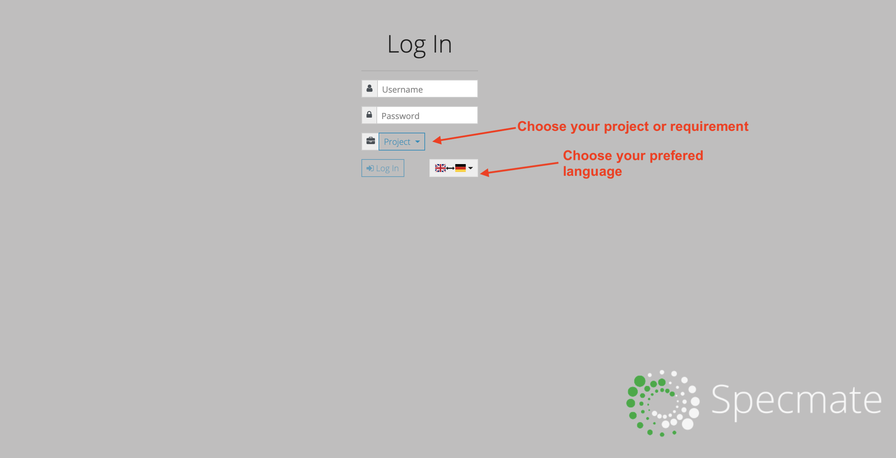

# Overview Usage and Methodology

Specmate supports you in designing tests from your requirements. Specmate imports your requirements from various sources such as Atlassian Jira. Once the requirements are imported, the first step is to describe the requirements in a lightweight model. Specmate supports cause-effect graphs (CEGs) and process diagrams (similar to an activity diagram).

CEGs are particularly suitable for describing requirements in the form "If... then ..." and thus, for example, for describing business rules. Process diagrams are particularly suitable for describing business processes and are therefore especially suitable for end-to-end testing.

Specmate has multiple uses and addresses different audiences: you can use Specmate in a classic, sequential development process as well as in an agile development process. In addition, you can use Specmate to perform test designs for different levels of testing.

- Developers can use Specmate to break down requirements and describe logic at component or class levels to derive component or unit tests.
- Technical testers can use Specmate to derive system tests from requirements (e.g., to test web services).
- Business analysts and product owners can use Specmate to derive acceptance tests from requirements.

## User Interface

After logging in to Specmate (directly or via Jira), you will see the following view

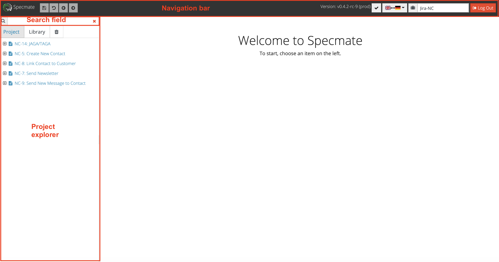

- On the left side you see the *Project Explorer*.
It displays the imported requirements in a tree structure. You can navigate through the tree (i.e. open the folders) and select a requirement.
- In the Project Explorer, you can switch between the *Project* view with the imported requirements and the *Library* view. In the project view, the folder structure is predefined by the requirement import, no new folders can be added at this point.
- In the library, you can freely add folders and models. Models can be created in both the Project View and the Library View.
- Above the project explorer there is a *search field*.
After entering a search word (from the requirement or user story title, or the corresponding Jira ID), the Project Explorer will display requirements and models that match the search word. Note that the library is not currently included in the search. You can learn more about the search feature in the [Search](###Search) section.
- In the upper part of the screen right next to the Specmate logo you will find buttons for saving the currently opened element, for navigation and for resetting the last action in a model editor. Once you are in the Model Editor, a Validate button appears as the fifth button at this location. Clicking the Validate button updates all changes and displays or cancels possible error messages under "Errors & Warnings" on the right side of the properties column. If the process of saving or validating takes a moment, Specmate will show you a circular loading bar.
- In the upper part of the screen on the right, you will see the current Specmate version. Next to it, by clicking on the checkmark button, you can show or hide the event log in the lower part of the screen, you can also choose the language you want to work with and log out.

### Project view

When a requirement is selected in the *Project View*, you will be shown the following view:

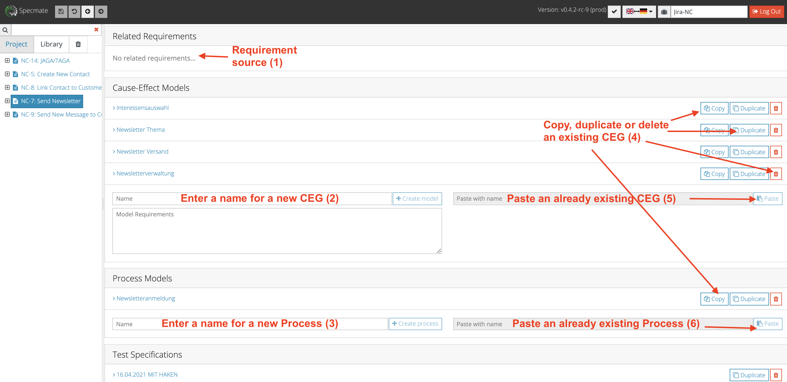

In this view, you can view all information about the requirements, as well as create associated models or test definitions, or view models or test definitions that have already been created.

### Library view

The library is your "construction kit" for models. Here you can store models or parts of models that you use frequently. By [Copy & Paste](#copy-and-paste) you can copy these building blocks and paste them into other models.

You can create and delete as many folders, subfolders, sub-subfolders, etc. in the library view as you like. To do this, click on the buttons shown by the figure above. In exactly the same way, you can save CEGs, process models and test specifications here. As described above, it is also possible to save only parts of more complex models that are used more frequently.

When a folder is selected in the *Library* view, the following view is displayed:

- In the 1st block you can get details about the selected folder.
- Changing the structure of the library (e.g. adding/removing folders) can be done in this 1st block "Sub-Folders".
- The top-level folder structure of the library is predefined in the project configuration and thus cannot be changed in Specmate itself.
- You can create cause-effect diagrams (2nd) or process models (3rd) in the respective section.
- In the 4th block you can create a new test specification.

### Search

- Specmate will not display matching search results until you have entered at least two characters in the search field.
- Only search results from the project you are logged into are displayed.
- Requirements or test procedures are displayed if the search term occurs as a prefix in the name, description, or ID of the requirement or test procedure (two characters or more).
- Specmate also supports *Wildcard searches*, namely
	- the wildcard search with "\*": the search finds all terms that are created by replacing "\*" with none or more characters. The search term "sta\*rs" thus finds terms like "stairs" or the novel "Starship Troopers" and the search term "pi\*zza" finds the Italian dish as well as the Italian word for town square "piazza".
	- the single-character wildcard search with "?": the search will find the terms "test" and "text", for example, if you enter "te?t".
	- However, the symbols "\*" and "?" cannot be used at the beginning of a search term.

# Create model

In the [Project View](###ProjectView) you can view all information about the requirement
and create related models or view already created models.

## How to decide which model to create?

For modeling requirements, you have the choice between
[cause-effect diagrams (CEG)](###editor-functions-in-CEG-editor) and [process models](###editor-functions-in-process-model-editor). Depending on whether the type of requirement is

- rule-based ("If this and that, then the following... with the exception of ... then...") or
- process-based ("First, the user enters A.  Based on the input, the system enters either B or C. Then the system asks the user for D, after which...") is,

you can select the appropriate modeling technique. When modeling rule-based requirements, cause-effect diagrams are used, while process-based requirements can be represented with process models.

## Basic Editor Functions for CEGs and Process Models

In this section you will learn the basic editor functions for both CEG and process models.
If the respective explanation is not sufficient for you or you want to get to know an extended application area, please read the more detailed explanations in the section [Extended functions and explanations to the cause-effect diagram](##Extendedfunctionsandexplanationstothecause-effectdiagram) or in the section [Extended functions and explanations to the process diagram](##Extendedfunctionsandexplanationstotheprocessdiagram).
If you only want to read about individual aspects in more detail, simply click on the linked terms to jump to the extended explanation further down in this guide.

### Editor Functions in the CEG editor

If you have decided to implement your requirements in a CEG model in the project view, you will reach the CEG editor. Here, Specmate provides you with various tools to model your CEGs.

In this figure you can see the buttons you have to use to

1. add one or more nodes by drag and drop.
2. add a linked node
3. arrange the nodes flush by clicking on the small structure tree (Auto-Layout)
4. show and hide the guides.
5. maximize the editor field in the view.

#### 1. Node

Click on the text "+Node", as shown in the picture, and drag the text "+Node" into the editor field provided with auxiliary lines. The node thus set now appears here as a rectangle in the modeling area.

You can also

- Rearrange nodes via drag & drop,
- copy and paste nodes,
- resize nodes: Select a node by mouse click. Small green squares appear at the edges of the node. If you move the mouse pointer over one of these squares, the cursor turns into a double arrow and you can now vary the size of the node as desired,
- click on a free space in the editor and thus edit the properties of the entire model.

If you want to learn even more about the different node types and their conditions, continue reading [here](###Nodes:-types-and-conditions).

#### 2. Linked Nodes

Move the cursor over the Linked Node tool and drag the node into the modeling area, just as you would when creating a normal node. However, no node will appear, but a window will be displayed. In the "Step 1" section, enter the name of the model you want to integrate into your base model in the search mask. If you have entered at least two characters in the search mask, Specmate will suggest suitable models. If you have selected a model in "Step 1", Specmate shows you possible nodes in "Step 2". Only target nodes of the model to be integrated are displayed.
In your base model, the link now appears as a single node that can be connected to other nodes just like other nodes of the model.

You can read more about this in the section
 [here](##Recurrences_in_CEG-Model).

#### 3. Auto Layout

By clicking on the small structure tree, Specmate will arrange the nodes of your model horizontally or vertically, as shown in the following images:

Before:

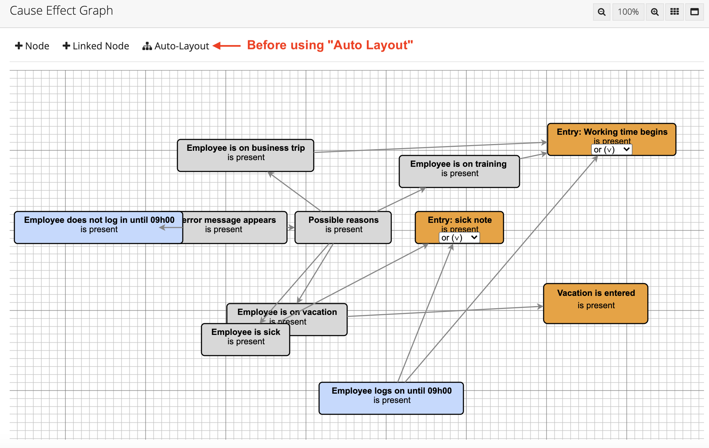

After:

You can also undo the Auto-Layout by clicking the "Undo Button" (top left).

#### 4. Show and hide Guides (Grids)

If you want to show or hide the auxiliary lines (grids), click on the buttons in the upper right corner.

#### 5. Maximize and enlarge Modeling Area

If you want to maximize the modeling area, click the buttons in the upper right corner. When you drag a node or connection into the area of the modeling space that is no longer visible to you, the Modeling Space automatically expands; scroll bars appear that allow you to move horizontally and vertically through the Model Editor.

#### 6. Create connections

Move your cursor to the node you have already created: A gray-bordered arrow in a circle will appear inside your node. Now you can connect the node to another node by dragging the connection from the first to the second node while holding down the mouse button.

1.) Move your cursor over a node: A gray-bordered arrow will appear in the center of the node; click on this arrow and hold down the mouse button while dragging the connection to another node:

2.) While you drag a connection, that one is visualized as a green dashed line; finished connections are shown as black arrows. The output node also appears in green-black dashed border during the connection.

3.) By clicking on the green boxes on the border of the node, you can enlarge the node or downsize it. By clicking on the node, when your cursor appears as a hand symbol, you can move nodes. The target location and size are also displayed in green dashed lines:

4.) You can also negate connections, if you want to know more details about this, continue reading [here](###negatingconnections).

#### 7. Select
If you want to select multiple connections and/or nodes, for example because you want to copy a part of your model and/or save it to the library, hold down the control key (Windows) or command key (Mac) while clicking on the desired elements.

#### 8. Error messages and warnings

For all error messages visualized by a triangle-framed exclamation mark, if you move your cursor over the icon, a small window will show you the reason for the error message. Fix the error and then click the Validate button in the upper left corner to make the error message disappear.
In the case of an erroneous model, you will not only see the errors locally in the model, but also in the Properties column under the Errors & Warnings heading on the right. If you think you have already fixed the reason for the error message displayed here, click the Validate button at the top left of the editor area. For more on validating, see [here](####Validate). A listing of various possible errors can be found [here](#errormessages).

#### 9. Delete

You can delete connections and nodes using the delete key (Windows) or by pressing the command and delete keys simultaneously (Mac). Or, right-click the connection (Windows) and select Delete in the pop-up that appears. For Mac, click on the connection and hold down the "control" key at the same time: now you can also select the "delete" option in the pop-up.

#### 10. Undo

If you press the usual Ctrl/CMD + Z key combination on the keyboard, Specmate will undo the last action you performed. Or click the Undo button in the upper left corner.

### Properties

On the right side of the editor you can view the *Properties*,
such as names or descriptions of the model and individual nodes and connections, and change them.

### Links & Actions

In the *Links & Actions* section, you can view the description of the requirement for which you are currently creating a model. Links to already generated test definitions are also displayed. [Test specifications](#testspecification) and [-procedures](#testprocedure) can be created and, if subsequently exported at this point.

### Editor functions in the process model editor

The process model editor functions in a similar way to the CEG editor: instead of being able to select "nodes" at the top left and drag them into the modeling area, there are even more differentiated options for the tools: in the process model, a starting point (+START) and an end point (+END) must be selected. For more details, see also [here](###Start/End). (The nodes in between are referred to here as steps and can be dragged into the modeling area using the +STEP tool. [Here](###Step) you can read more about this topic). There is also the +DECISION tool, which visualizes a split in the process - [More on Decision](###Decision). The auto-layout function can also be used in the Process Model Editor by clicking on the small structure tree.

Connections are created as in the CEG editor by moving the cursor over the respective node (this also applies to the start, end and decision nodes); a gray-bordered arrow appears in the node, which can be dragged as a connection to any node by clicking the mouse button. Only the connections originating from a decision node differ in that they must be assigned a condition in the right property column. In contrast to the CEG editor, the nodes can only be named in the property column and not directly by clicking on a node. For further explanation, see the section [Connections in the Process Model](###Connections-in-the-process-model).

#### Traces

The *Traces* column shows all the requirements associated with the selected step. Traces are only displayed in process diagrams and only when a step is selected. In addition, you can add requirements by searching for them in the search field. It is possible to search by both the ID and the name of the requirement. The displayed requirements can then be added to the selected step by clicking on them. Requirements that have already been added can be deleted by clicking on the adjacent red trash can icon.

### Copy and Paste

#### Copying from the Editors

In all editors, you have the option of copying the model or parts of it and pasting it into other models. To do this, drag a rectangle around the area you want to copy. Like for example here:

When the area is marked, all marked nodes and links are marked with a green broken line:

Press Ctrl + C (Windows keyboard) or cmd + C (Mac keyboard) to copy the area. The copied model can be pasted again in the same or other editors with Ctrl + V (Windows keyboard) or cmd + V (Mac keyboard) and further edited.

#### Copying from the Project or Library View.

You can also copy whole models by clicking, e.g. in the [Library View](#library)
click on the *Copy* button of the desired model.

Now you can create a copy of the model in the library view or in the project view.

By default, the new model is called "*Copy of [name of original model]*".
You can change this name in the input field: By clicking the *Paste* button, you add the copy of the model to the project.

## Advanced Functions and Explanations of the Cause-Effect Diagram.

After opening the cause-effect editor, you will be presented with a modeling area in the center where you can create your CEG. To model a CEG, you can select a tool above the modeling area. By clicking on *Node* and holding down the mouse button, you can drag the node into the modeling area to create a new node. By default, the name of the node is *variable* and the condition is set to *is present*. You can read what is meant by these terms in the following sections. You can change the attributes of the selected node on the right side in the [*Properties Section*](#Properties).

### Connection

To connect two nodes, proceed as follows:
Move your cursor to the node you have already created to be the cause: A gray bordered arrow will appear inside your node. Now you can connect the node to another node that should represent the effect by dragging the connection from the first to the second node while holding down the mouse button.

#### Negate connections

*Negate* negates the connection between two nodes. This means that the effect occurs
when the cause is not present, and the effect remains absent when the cause is present.

When a connection is created and selected, you also have the option to [negate](#negate) the connection: to do this, simply click on the connection you want to negate and check "Negate" in the properties column on the right. Or right-click on the connection (Windows) or hold down the control key when clicking on the connection (Mac): A pop-up appears where you can select the options "Delete" or "Negate". The connection will then appear in the editor as a dashed line (arrow), whereas a normal connection will appear as an arrow with a solid line.

If you want to check if your CEG model is correct, click on the Validate button in the upper left corner and see if anything appears in the *Properties* column under the *Errors & Warnings* heading. For example, an unnamed node will show up as an error. You can learn more about validating below or [here](####Validate).

#### Description

You can add a *description* to any connection between two nodes. This can add to your own understanding or that of a colleague. Also, as explained above, you can change the type of the node in the *Properties* column.

Make sure that the node or connection whose properties you want to edit has been clicked before. You can also tell if this is the case by the green dashed border, as illustrated in the previous figure. If no individual component (node or connection) in the model is clicked, the properties of the entire model are described in the properties column.

### Nodes: Types and conditions

A node describes a cause or an effect. A node can also be the cause and effect of one or more other nodes. There are two basic types of nodes:

- Nodes that can only have two attributes/conditions. So all conditions that can be answered with yes/no.

Example:
- Variable: *Driving license available*.
- Condition: *yes* or *no

Nodes that can have more than two values/conditions.

Example:
- Variable: *region
- Condition: *Europe*, *Africa*, *Asia*, *America*, ...

If several nodes have the same variable name, this can lead to difficulties during test generation. In this case it is recommended to use the *equal* operator. More about this in chapter [Condition](####Condition).

Also, the following characters must not be used in the name of the node:
- , (comma)
- ; (semicolon)
- | (vertical bar)

However, in the formulation of the conditions, the use of the characters is allowed.

If you have selected a node in the editor, then you have the possibility to change the *properties* of the node on the right side. The following properties can be edited:

### Variable

Here you can change the name of the variable, i.e. the name of the cause or effect.

### Condition

The condition that the variable can assume is set to *is present* by default.
To change the description of the condition, please select the corresponding node and write the desired condition in the *Condition* field.

If several nodes have the same variable name, you can avoid difficulties in test generation,
by placing an '=' in front of the condition. This tells Specmate that only one condition of the variable can be true.
For example, if there are several nodes with the variable name *Region*, you can write as condition for example
*=Europe* as a condition. With the test generation it is then made sure that all nodes, which have the same
variable names and for which the condition is set with =, always exactly one node is true at the same time.
A proven procedure is to declare the variables always as positive statements
(e.g. *Doors locked: true* instead of *Doors not locked: not true*).

### Type And/Or

If a node has multiple incoming connections, you can change the *type* of the node. To do so, select the corresponding node and change the *type* of the node on the right side under *Properties*. Depending on the type of the node, incoming connections can be defined as OR links or AND links. If the type of the node is set to AND, then all predecessor nodes
with a connection to the respective node must already be fulfilled,
so that the node is fulfilled.

Example of an AND relationship:

However, if the type of the node is set to OR, only a single direct antecedent must be satisfied,
for the node to be satisfied. This OR is an *inclusive OR*, meaning both causes can also be true for the node to be satisfied. Not to be confused with an [Exclusive Or](#exclusive-OR), where *exactly one* cause must be true for the node to be satisfied.

Example of an OR relationship:

### Recurrences in the CEG model

To design even more complex CEGs, Specmate provides the ability to recurrently link multiple CEG models.

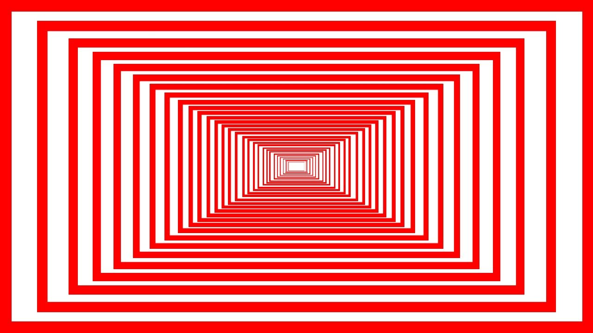

In short, this means that a model (or several models) can be integrated into another model. To do this, the target node of the integrated model is inserted into the integrating model as a linked node. In this way, complex conditions can be formulated without compromising the clarity of the model. How this works exactly will be explained in the following with the help of a short example.

If you want to define the node "Newsletter Topic" more precisely in the following, you can design a separate model for this purpose.

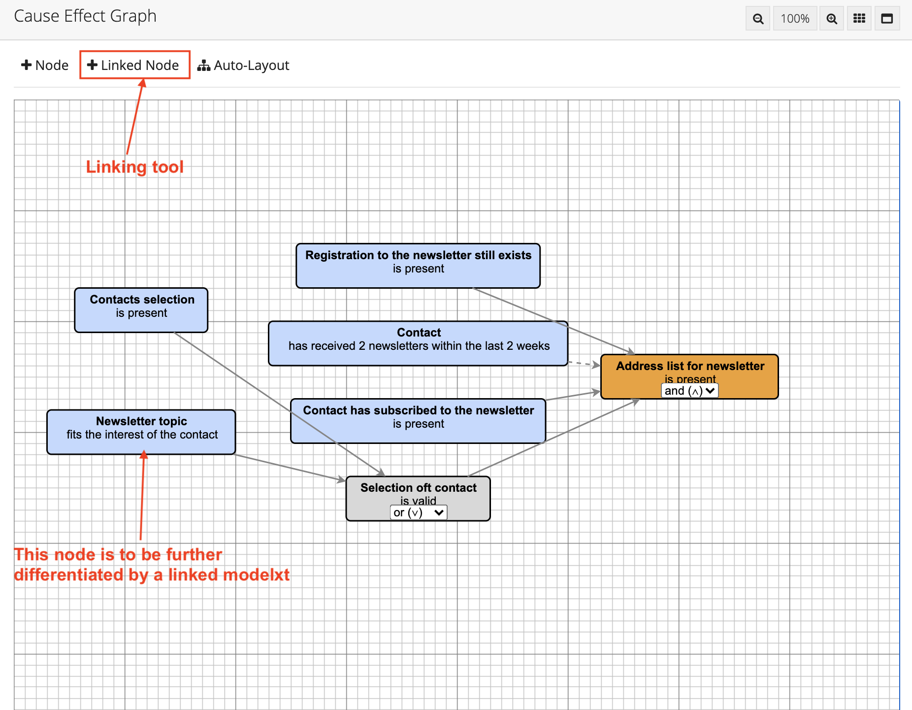

The following model would determine the topic selection of the newsletter a bit more precisely:

If this model is to be integrated into the existing base model, this can be done using the "Linked Node" tool. The tool is called "Linked Node" and not "Linked Model" because it is always the target node of the integrated model that is linked to the base model:

.

To create such a link, move the cursor over the "Linked Node" tool and drag the node - just like creating a normal node - into the modeling area. However, no node will appear, but a window will be displayed:

.

In the "Step 1" section, enter the name of the model you want to integrate into your base model in the search mask. If you have entered at least two characters in the search mask, Specmate will suggest suitable models. If you have selected a model in "Step 1", Specmate shows you possible nodes in "Step 2". Only target nodes of the model to be integrated are displayed.

In your base model, the link now appears as a single node that can be connected to other nodes just like other nodes of the model:

### Important rules for linking models.
- It is important that you do not try to form a circle in which model A refers to model B and model B refers to model A. This will result in an error message.
When you generate a test definition, the linked node appears as a normal node in the test definition.
- Only effect nodes that have no outgoing connections can be linked. In the figure above, the gray "Contact selection" node cannot be linked because it is a cause and effect node and has outgoing connections from it. The orange "Address list for newsletter" node, on the other hand, can be linked.
- Only nodes from other models can be linked.
- If the linked node is (accidentally) deleted in the linked model, Specmate displays an error message.

#### Excursus Exclusive Or

An *Exclusive Or*, or *XOR*, states that *exactly one* cause must be true to produce an effect. In English language, you can recognize such an Exclusive Or by the phrase "either.... oder... (but not both)".

In Specmate, the Exclusive Or can be easily constructed: For example, if you have the statement "Either A, or B, then C" you can model this statement using two auxiliary variables D and E and by [negation](#negating):

.

So the statement is rewritten as "If A and not B, or B and not A, then C".

#### Description

You can add a *description* to any connection between two nodes. This can add to your own understanding or that of a colleague. Also, as explained above, you can change the type of the node in the *Properties* column.

Make sure that the node or connection whose properties you want to edit has been clicked on before. You can also see if this is the case by the green dashed border, as illustrated in the previous figure. If no individual component (node or connection) in the model is clicked, the properties of the entire model are described in the properties column.

### Validate

When you create or have created a CEG model or process model, you can see another button at the top left of the screen next to the Specmate logo: the *Validate* button. Clicking this button will update the validation of your model. If your model is correct, you will see the message "No Warnings." in green font in the *Properties* section under the heading *Errors & Warnings*. If your model is incorrect, the errors will be listed here. In this case, you must fix the error and click the *Validate* button again. Clicking the *Validate* button is also necessary to make a later test generation possible at all.

Specmate displays the nodes visually differently depending on their position in the CEG model, as shown in the following figure:

## Equivalence class analysis

### Motivation and goal

It is often a problem to determine a selection of suitable value classes from a large set of possible value classes of variables (e.g. age of a person). By selecting a few value classes, the tester decides not to test many situations. Therefore, it is important that this selection is done very carefully. Ideally, the selection of value classes should cover as many situations as possible. This is where the *equivalence class analysis* helps.

The goal of forming equivalence classes is to achieve a high error detection rate with the smallest possible number of test cases. Thus, equivalence classes are similar classes or objects with respect to input and output data that are expected to behave in the same way. Consequently, each value of an equivalence class is a suitable representative proxy for all values of the equivalence class.

#### Example 1

Equivalence classes often need to be uniquely determined. For example, a requirement might be

The robot assistant for trading securities is instructed to sell shares of a certain company A when they have reached or exceeded a certain value e.g. 14€.

Here the equivalence classes for the input variable *value* are:

- Equivalence class 1: >14€
- Equivalence class 2: <=14€

And for the output variable *sell*:

- Equivalence class 1: sell
- Equivalence class 2: do not sell

The corresponding CEG model would then look like this:

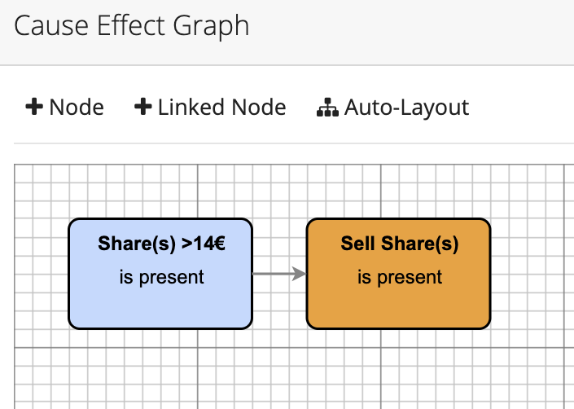

In general:

> If a variable has *n* expressions, the model requires *n-1* nodes.

#### Example 2

The *Example 1* can be developed to the following requirement:

> The robo-assistant should sell the shares of company A if they have reached or exceeded the value of 14€. However, if the value of the shares is between 12€ and 13.99€ for a longer period of time, the shares may also be sold if shares of company B have been purchased.

Here the equivalence classes for the input variable *value* are:

- Equivalence class 1: *>14€*.
- Equivalence class 2: *12€< value <= 14€*.
- Equivalence class 2: *<12€*

There is a second input variable here, namely *purchase of shares company B*. Here the equivalence classes are:

- Equivalence class 1: *B shares purchased*.
- Equivalence class 2: *B shares not purchased*.

The output variable *Sell shares* remains the same.

It is recommended to introduce an additional variable *Transition time* here, which occurs when share A is worth less than 14€, but not less than 12€. The corresponding CEG model then looks as follows:

## Extended functions and explanations of the process diagram

To model process models, first open the corresponding editor. Use the [*step*](#step) tool to add an action to the model.
Each model must have a start node and at least one end node.

You add a decision node to the model by using the tool
[*decision*](#decision) tool.

To connect two elements, you need to move the cursor over a node - as in the CEG model - and once the arrow outlined in gray appears, hold down the cursor and drag the connection to any other element. For each connection, you can set a condition that the previous node must satisfy. When using the decision node, you can specify the conditions of the outgoing connections that must be met to follow the specific connection in the model. When a node is selected, Specmate displays the properties of the node on the right. You can also specify the expected result of this step in the Properties pane in the Description section.

The following figure shows the process of an ATM,
modeled with the Process Model Editor:

### Start/End

*Start* and *End* describe the start and end of the procedure. There can be only one start node in a procedure, but multiple end nodes can be specified.

### Step

A *step* describes an action that is to be executed. If a step node is selected, you have the option of changing the *name* of the step, i.e. the action that is to be performed, adding a *description* and specifying the expected result of the step.

### Decision

A *decision* is a step that can have multiple outcomes. Once a decision node is selected, you can change the *name* of the decision, that is, change which decision must be made. You can also add a *description* of the node.

### Connections in the process model

A *connection* describes a transition from one node to the next. A *step* can have only one output, that is, only one outgoing connection. A *decision*, however, can have multiple outputs and therefore multiple outgoing connections. *Step* and *Decision* can each have multiple incoming connections. If a *connection* is selected, you can specify the *condition* that the previous node assumed. You can also add a *description*.

### Validate in the Process Model

You can also validate your process models using the *Validate* button. When you click on this button, the validation of your model will be updated. If your model is correct, you will see "No Warnings." in green font in the *Properties* section under the *Errors and Warnings* heading. If your model is incorrect, the error will be listed here. In this case, you will need to fix the error and click the *Validate* button again.
A listing of various possible errors can be found in the following section.

# Error Messages

In the following, you will find the corresponding causes when Specmate shows you an error message. For all error messages, visualized by a triangular framed exclamation mark in the model editor, if you move your cursor over the icon, a small window will show you the reason for the error message.

## 1. Error Messages for Process Models

If you get an error message in the Process Model Editor, check if one of the following scenarios applies to you:

- No name has been assigned to one of the model elements or the model.
- There is more or less than exactly one start node.
- There is no end node.
- There are nodes with no incoming connection(s).
- There are nodes without outgoing connection(s).
- There are no activity nodes.
- No conditions are specified for the outgoing connections of a decision node.
- A start node has one or more incoming connections.
- A start node has more than one outgoing connection.
- An activity node has more than one outgoing connection.
- An end node has one or more outgoing connections.
- A decision node has only one outgoing connection.
- There is one node with empty variable names.

If one or more of these scenarios applies to your process model, fix the source of the error and press the Validate button again.

## 2. Error Messages for CEG Models

If you get an error message in the CEG model editor, check if one of the following scenarios applies to you:

- No name has been assigned for one of the model elements or the model.
- There is no condition(s) specified for one or more nodes.
- There are nodes with no incoming or outgoing connections.
- The model is empty and has no nodes.
- There are identical variable names for effect and cause nodes.
- There is a node with empty variable names.
- For linked nodes: the linked model also refers to the linking model (circle).

If one or more of these scenarios apply to your CEG model, fix the source of the error and click the Validate button again.

# Test Specification

You have the option to create a test case specification manually or to generate it automatically from a model. By looking at the specification's icon in the Project Explorer, you can see whether it is generated automatically or manually.

Automatically generated: 

Manually generated: 

The test case specification name is based on the date and time the specification was created. You have the possibility to change the specification's name and add a description.

## Test Specifications from CEG Models

The specification consists of several test cases, where each test case has a specific configuration. A test case assigns a value to each variable. In certain test cases, Specmate leaves the value of a variable blank. If this is the case, the variable is not restricted to a specific value. Rules are used to create the specification to ensure an optimal relationship between test coverage and the number of test cases. This prevents the number of test cases from growing exponentially as the causes grow.

It may happen that inconsistent tests are generated where Specmate could not satisfy all test generation rules, or that the model is inconsistent in some other way: for example, because the conditions of the variables differ because of the
[*= operator*](#condition) contradict each other. Specmate indicates inconsistent tests by highlighting these tests in red. In this case, check your model or adjust your test cases.
If two or more CEG nodes have the same variable and the condition starts with character "=", then Specmate generates the test cases such that for each test case exactly *one* of the nodes is true.

Example:
Node 1: Currency = EUR
Node 2: Currency = DOLLAR

The nodes that are in the *Input* column are variables that represent the causes from the model. These are all nodes that have no incoming connections.
Below the *Output* column are the variables that represent the effects. These are all nodes that have no outgoing connections. You can also manually add more input and output variables or delete existing ones. You can also manually drag and drop to rearrange the individual test cases.

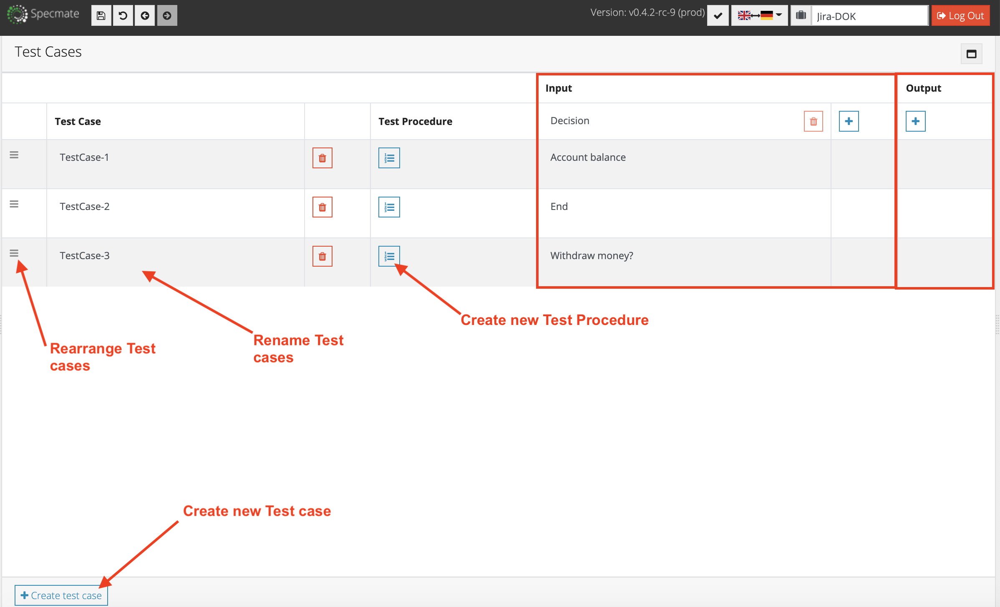

You can also delete a test case by clicking on the trash icon of the respective test case. If you want to add test cases manually, you can press the *Create test case* button in the lower area. The order of the test cases can be changed by drag & drop.

### Rules for Creating Test Definitions

- If the effect node is *true* and the type of input nodes is AND, there is only one combination of input nodes. Namely: all input nodes are *true*.
- If the effect node is *false* and the type of the input nodes is AND, only combinations are tested where exactly one input node is *false* and all others are *true*.
- If the effect node is *true* and the type of the input nodes is OR, only combinations are tested where exactly one input node is *true* and all others are *false*.
- If the effect node is *false* and the type of the input nodes is OR, there is only one combination of input nodes. Namely: all input nodes are *false*.

## Test Specification from Process Models

The specification consists of several test cases, where each test case has a specific configuration. A test case assigns one of the available decisions to each decision node and then sets that decision to *true* accordingly.
Rules are used to create the specification to ensure an optimal balance between test coverage and number of test cases. Again, you can add more test cases or decisions or delete existing ones. You can drag and drop the order of the test cases.

# Test Procedure

You can create a test procedure for each test case. Here you can define all necessary steps for the respective test case. When modeling a CEG, the test procedure must be added manually. Creating a test case specification from a process diagram results in automatically created test procedures.

You can view the already automatically created test procedure (process diagram) by clicking on the blue box with numbered enumeration, as shown in the following figure:

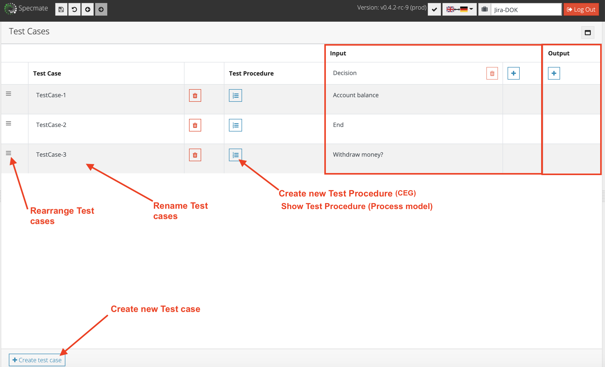

If you click on this box for a CEG, you can create your test procedure here. Click on the lower button *Create test case* to add more test cases manually. To rename them, click on the automatically created test case name (TestCase-1, TestCase-2...).

Test procedures can be exported (as well as test definitions).
In each step of the test procedure you can refer to parameters from the created model. The parameters from the model can be set to a specific value in the parameter mapping.
When the creation of a test procedure is complete, you can export it to Jira XRay Cloud, for example, using the *Export test procedure* button on the right-hand side and edit it further there. Before you export a test procedure, it is essential that you save it first. You can also open and edit an already created test procedure by clicking on it in the [Project Explorer](#userinterface) or in the [Requirements Overview](#traces).

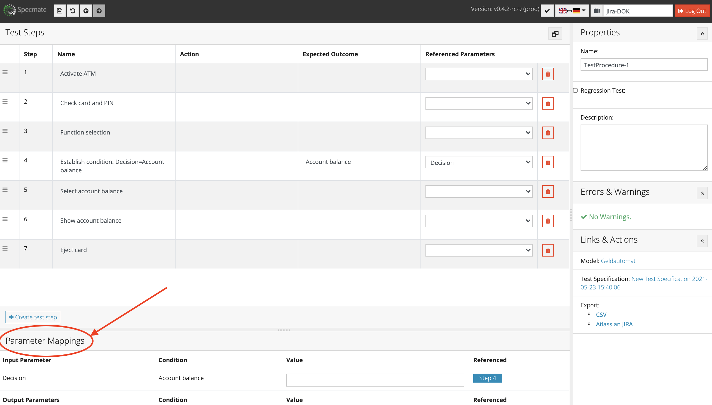

# Export of Test Specifications and Procedures

Specmate allows exporting [test-specifications](#test-specification) and [-procedures](#test-procedure) in different ways and formats.

## Exporting Test Specifications

Test specifications can be exported in Specmate in three formats:

- as a CSV file
- as Java test shells
- as JavaScript test cases

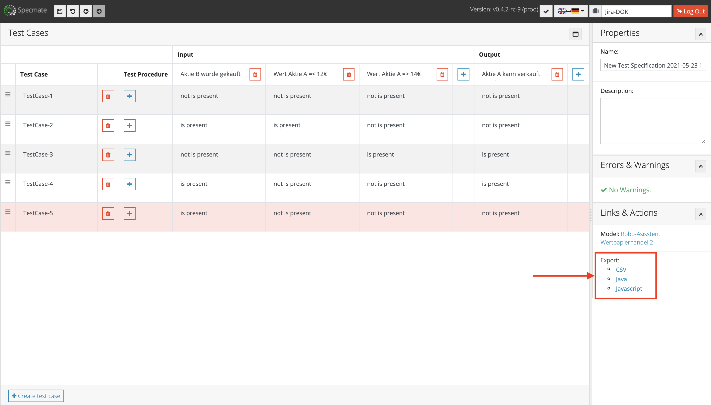

Parameter mapping in test steps can be exported in CSV format or directly to Atlassian JIRA:

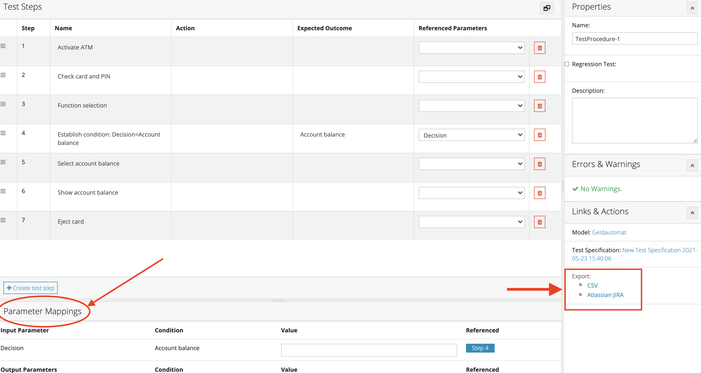

Should you decide to **export as CSV**, the exported test definition will look like this:

`"TC";"INPUT - Aktie B wurde gekauft";"INPUT - Wert Aktie A =< 12€";"INPUT - Wert Aktie A => 14€";"OUTPUT - Aktie A kann verkauft werden"
TestCase-1;"not is present";"not is present";"not is present";"not is present"
TestCase-2;"is present";"is present";"not is present";"not is present"
TestCase-3;"not is present";"not is present";"is present";"is present"
TestCase-4;"is present";"not is present";"not is present";"is present"
TestCase-5;"is present";"not is present";"not is present";"not is present"
`

If you decide to **export as JAVA**, the exported test definition will look like this:

`import org.junit.Test;
import org.junit.Assert;

/*
 * Datum: 2021-05-23 14:00
 */

public class New_Test_Specification_2021_05_23_15_55_12Test {

	/*
	 * Testfall: TestCase-1
	 */
	@Test
	public void New_Test_Specification_2021_05_23_15_55_12Test___Aktie_B_wurde_gekauft__not_is_present___Wert_Aktie_A____12___not_is_present___Wert_Aktie_A____14___not_is_present___Aktie_A_kann_verkauft_werden__not_is_present() {
		Assert.throw();
	}

	/*
	 * Testfall: TestCase-2
	 */
	@Test
	public void New_Test_Specification_2021_05_23_15_55_12Test___Aktie_B_wurde_gekauft__is_present___Wert_Aktie_A____12___is_present___Wert_Aktie_A____14___not_is_present___Aktie_A_kann_verkauft_werden__not_is_present() {
		Assert.throw();
	}

	/*
	 * Testfall: TestCase-3
	 */
	@Test
	public void New_Test_Specification_2021_05_23_15_55_12Test___Aktie_B_wurde_gekauft__not_is_present___Wert_Aktie_A____12___not_is_present___Wert_Aktie_A____14___is_present___Aktie_A_kann_verkauft_werden__is_present() {
		Assert.throw();
	}

	/*
	 * Testfall: TestCase-4
	 */
	@Test
	public void New_Test_Specification_2021_05_23_15_55_12Test___Aktie_B_wurde_gekauft__is_present___Wert_Aktie_A____12___not_is_present___Wert_Aktie_A____14___not_is_present___Aktie_A_kann_verkauft_werden__is_present() {
		Assert.throw();
	}

	/*
	 * Testfall: TestCase-5
	 */
	@Test
	public void New_Test_Specification_2021_05_23_15_55_12Test___Aktie_B_wurde_gekauft__is_present___Wert_Aktie_A____12___not_is_present___Wert_Aktie_A____14___not_is_present___Aktie_A_kann_verkauft_werden__not_is_present() {
		Assert.throw();
	}

}`

Should you decide to **export as JavaScript**, the exported test definition will look like this:

`/*
 * Datum: 2021-05-23 14:00
 */

describe('New_Test_Specification_2021_05_23_15_55_12', () => {

	/*
	 * Testfall: TestCase-1
	 */
	it('New_Test_Specification_2021_05_23_15_55_12___Aktie_B_wurde_gekauft__not_is_present___Wert_Aktie_A____12___not_is_present___Wert_Aktie_A____14___not_is_present___Aktie_A_kann_verkauft_werden__not_is_present', () => {
		throw new Error('not implemented yet');
	});

	/*
	 * Testfall: TestCase-2
	 */
	it('New_Test_Specification_2021_05_23_15_55_12___Aktie_B_wurde_gekauft__is_present___Wert_Aktie_A____12___is_present___Wert_Aktie_A____14___not_is_present___Aktie_A_kann_verkauft_werden__not_is_present', () => {
		throw new Error('not implemented yet');
	});

	/*
	 * Testfall: TestCase-3
	 */
	it('New_Test_Specification_2021_05_23_15_55_12___Aktie_B_wurde_gekauft__not_is_present___Wert_Aktie_A____12___not_is_present___Wert_Aktie_A____14___is_present___Aktie_A_kann_verkauft_werden__is_present', () => {
		throw new Error('not implemented yet');
	});

	/*
	 * Testfall: TestCase-4
	 */
	it('New_Test_Specification_2021_05_23_15_55_12___Aktie_B_wurde_gekauft__is_present___Wert_Aktie_A____12___not_is_present___Wert_Aktie_A____14___not_is_present___Aktie_A_kann_verkauft_werden__is_present', () => {
		throw new Error('not implemented yet');
	});

	/*
	 * Testfall: TestCase-5
	 */
	it('New_Test_Specification_2021_05_23_15_55_12___Aktie_B_wurde_gekauft__is_present___Wert_Aktie_A____12___not_is_present___Wert_Aktie_A____14___not_is_present___Aktie_A_kann_verkauft_werden__not_is_present', () => {
		throw new Error('not implemented yet');
	});

});`

To export a test definition, please navigate to the relevant test definition in Specmate (e.g. via the [Requirements Overview](#traces)). On the right side in the [Links & Actions](#links-actions) section you will find the subsection for export. Click on the link for the desired export format and save the offered file to your computer.
