## Inhalt

- [Installation, Konfiguration und Inbetriebnahme](#Installation,KonfigurationundInbetriebnahme)
	- [Installation](##Installation)
	- [Konfiguration](##Konfiguration)
	- [Start von Specmate](##StartvonSpecmate)
	- [Login](##Login)
- [Überblick Verwendung und Methodik](#ÜberblickVerwendungundMethodik)
	- [Bedienoberfläche](##Bedienoberfläche)
		- [Projektansicht](###Projektansicht)
		- [Bibliotheksansicht](###Bibliotheksansicht)
		- [Suche](###Suche)
- [Modell erstellen](#Modellerstellen)
	- [Wie entscheiden Sie, welches Modell zu erstellen ist?](##WieentscheidenSie,welchesModellzuerstellenist?)
	- [Grundlegende Editorfunktionen für CEGs und Prozessmodelle](###GrundlegendeEditorfunktionenfürCEGsundProzessmodelle)
		- [Editor-Funktionen im CEG-Editor](###EditorFunktionenimCEG-Editor)
			- [1. Knoten](####1.Knoten)
			- [2. Verknüpfte Knoten](####2.VerknüpfteKnoten)
			- [3. Auto-Layout](####3.Auto-Layout)
			- [4. Hilfslinien (Gitter) ein- und ausblenden](####4.Hilfslinien(Gitter)ein-undausblenden)
			- [5. Modellierungsbereich maximieren und vergrößern](####5.Modellierungsbereichmaximierenundvergrößern)
			- [6. Verbindungen erstellen](####6.Verbindungenerstellen)
			- [7. Markieren](####7.Markieren)
			- [8. Fehlermeldungen und Warnungen](####8.FehlermeldungenundWarnungen)
			- [9. Löschen](####9.Löschen)
			- [10. Rückgängig machen](####10.Rückgängigmachen)
		- [Eigenschaften](###Eigenschaften)
		- [Links & Actions](###Links&Actions)
		- [Editor-Funktionen im Prozessmodell-Editor](###EditorFunktionenimProzessmodell-Editor)
			- [Traces](####Traces)
			- [Copy and Paste](###CopyandPaste)
		- [Kopieren aus den Editoren](####KopierenausdenEditoren)
		- [Kopieren aus der Projekt- oder Bibliotheksansicht](####KopierenausderProjekt-oderBibliotheksansicht)
	-[Erweiterte Funktionen und Erläuterungen zum Ursache-Wirkungs-Diagramm](##ErweiterteFunktionenundErläuterungenzumUrsache-Wirkungs-Diagramm)
	-[Verbindung](###Verbindung)
	 - [Verbindungen negieren](####Verbindungennegieren)
		- [Beschreibung](####Beschreibung)
	- [Knoten: Arten und Bedingungen](###Knoten:ArtenundBedingungen)
	- [Variable](###Variable)
	- [Bedingung](###Bedingung)
	- [Typ And/Or](###TypAnd/Or)
	- [Rekurrenzen im CEG-Modell](###RekurrenzenimCEG-Modell)
		- [Exkurs: Exklusives Oder](####ExkursExklusivesOder)
	- [Validieren](###Validieren)
- [Äquivalenklassenanalyse](##Äquivalenzklassenanalyse)
	- [Motivation und Ziel](###MotivationundZiel)
		- [Beispiel 1](####Beispiel1)
		- [Beispiel 2](####Beispiel2)
- [Erweiterte Funktionen und Erläuterungen zum Prozessmodell](##ErweiterteFunktionenundErläuterungenzumProzessmodell)
	- [Start/Ende](###Start/Ende)
	- [Schritt](###Schritt)
	- [Entscheidung](###Entscheidung)
	- [Verbindungen im Prozessmodell](###VerbindungenimProzessmodell)
	- [Validieren im Prozessmodell](###alidierenimProzessmodell)
- [Fehlermeldungen](#Fehlermeldungen)
	- [Fehlermeldungen bei Prozessmodellen](##FehlermeldungenbeiProzessmodellen)
	- [Fehlermeldungen bei CEG-Modellen](##FehlermeldungenbeiCEG-Modellen)
- [Testspezifikation](#Testspezifikation)
	- [Testspezifikation aus CEG-Modellen](##TestspezifikationausCEG-Modellen)
		- [Regeln zur Erzeugung von Testspezifikationen](###RegelnzurErzeugungvonTestspezifikationen)
	- [Testspezifikation aus Prozessmodellen](##TestspezifikationausProzessmodellen)
- [Testprozedur](#Testprozedur)
	- [Export von Testspezifikationen und -prozeduren](#ExportvonTestspezifikationenund-prozeduren)
		- [Export von Testspezifikationen](##ExportvonTestspezifikationen)
- [Bibliothek](#Bibliothek)

# Installation, Konfiguration und Inbetriebnahme

## Installation

* Stellen Sie sicher, dass Java 11 installiert ist. Wenn nicht, besorgen Sie es sich z.B. von [hier](https://www.oracle.com/de/java/technologies/javase-downloads.html). Um herauszufinden, welche Java-Version Sie gerade verwenden, geben Sie `java -version` in Ihre Konsole ein.
* Besorgen Sie sich die neueste Version von Specmate auf der Download-Seite. Wo und wie Sie die Datei herunterladen, lesen Sie im nächsten Abschnitt [Konfiguration](##Konfiguration).
Diese Anleitung ist speziell für die Version 0.4.2. von Specmate geschrieben, wenn Sie eine andere Version verwenden, kann es zu kleinen Abweichungen kommen.
* Wir empfehlen Ihnen für Specmate den Browser "Google Chrome" zu verwenden, da Specmate mit Chrome am besten funktioniert und die Wahrscheinlichkeit von Darstellungsfehlern so minimiert wird. [Hier](https://www.google.com/intl/de_de/chrome/) können Sie Chrome downloaden. Sollten Sie eine zu alte Browserversion verwenden, zeigt Ihnen Specmate eine Warnung an.

## Konfiguration
- Laden Sie sich auf der [Specmate-Homepage](https://specmate.io/?page_id=14) die neueste Version von Specmate herunter.
- Entpacken Sie die Zip-Datei und starten Sie die in dem Ordner enthaltene Stapelverarbeitungsdatei mithilfe Ihrer Konsole. Sie erkennen diese Datei an der Endung ".sh" oder ".bat" abhängig von Ihrem Betriebssystem (sh bei Mac und Linux und bat bei Windows).

## Start von Specmate
Specmate ist ein web-basiertes Werkzeug. Wenn Sie Specmate auf Ihrem lokalen Rechner installiert  und gestartet haben, öffnen Sie Ihren Browser (am besten Chrome) und navigieren Sie zu http://localhost:8080 oder der Ihnen für Specmate zugewiesenen Seite, um auf die Startseite von Specmate zuzugreifen.

## Login
Nach dem Aufruf von Specmate wird Ihnen die Anmeldeseite angezeigt. Bitte geben Sie hier einen Benutzernamen, ein Passwort und ein Specmate-Projekt ein. Für die Verwendung von Specmate benötigen Sie keinen dezidierten Login, stattdessen können Sie die Anmeldedaten der Anforderungsquelle, die mit dem Specmate-Projekt verbunden ist, verwenden. Außerdem können Sie bereits bei Ihrer Anmeldung zwischen deutscher und englischer Sprache wählen:

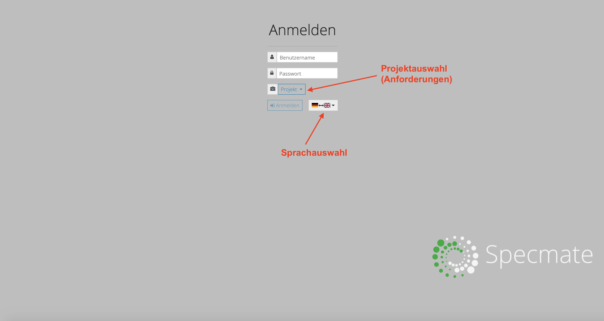

# Überblick Verwendung und Methodik

Specmate unterstützt Sie im Design von Tests aus Ihren Anforderungen. Specmate importiert Ihre Anforderungen aus verschiedenen Quellen wie z.B. Atlassian Jira. Sind die Anforderungen importiert, können Sie in einem ersten Schritt die Anforderungen in einem leichtgewichtigen Modell beschreiben. Specmate unterstützt Ursache-Wirkungs-Diagramme (engl. Cause-Effect-Graphs, CEGs) und Prozessdiagramme (ähnlich einem Aktivitätsdiagramm).

CEGs eignen sich besonders zur Beschreibung für Anforderungen in der Form "Wenn... dann ..." und somit z.B. zur Beschreibung von  Geschäftsregeln. Prozessdiagramme eignen sich besonders zur Beschreibung von Geschäftsprozessen und sind daher vor allem für End-to-End-Tests geeignet.

Specmate ist vielfach einsetzbar und richtet sich an unterschiedliche Zielgruppen: Sie können Specmate sowohl in einem klassischen, sequenziellen als auch in einem agilen Entwicklungsprozess nutzen. Außerdem können Sie mit Specmate Test-Designs für verschiedene Test-Stufen durchführen.

- Entwickler können Specmate nutzen, um Anforderungen herunterzubrechen und die Logik auf Ebenen von Komponenten oder Klassen zu beschreiben und daraus Komponenten- oder Unit-Tests abzuleiten.
- Technische Tester können Specmate nutzen, um aus Anforderungen Systemtests (z.B. zum Test von Web-Services) abzuleiten.
- Business-Analysten und Product-Owner können Specmate nutzen, um aus Anforderungen Akzeptanztests abzuleiten.

## Bedienoberfläche

Nach dem Anmelden bei Specmate (direkt oder über Jira) sehen Sie folgende Ansicht

- Auf der linken Seite sehen Sie den *Projekt-Explorer*.
Er zeigt die importierten Anforderungen in einer Baumstruktur an. Sie können durch den Baum navigieren (d.h. die Ordner öffnen) und eine Anforderung auswählen.
- Im Projekt-Explorer können Sie zwischen der *Projekt*ansicht mit den importierten Anforderungen und der *Bibliotheks*ansicht wechseln. In der Projektansicht ist die Ordnerstruktur durch den Anforderungs-Import vorgegeben, es können an dieser Stelle keine neuen Ordner hinzugefügt werden.
- In der Bibliothek können Sie Ordner und Modelle frei hinzufügen. Sowohl in der Projektansicht als auch in der Bibliotheksansicht können Modelle erstellt werden.
- Über dem Projekt-Explorer befindet sich ein *Suchfeld*.
Nach der Eingabe eines Suchwortes (aus dem Titel der Anforderung oder der User Story oder der entsprechenden Jira-ID) zeigt der Projekt-Explorer Anforderungen und Modelle an, die dem Suchwort entsprechen. Beachten Sie bitte, dass die Bibliothek derzeit nicht in die Suche miteinbezogen ist. Mehr zur Suchfunktion erfahren Sie im Abschnitt [Suche](###Suche).
- Im oberen Teil des Bildschirms direkt neben dem Specmate-Logo finden Sie Schaltflächen zum Speichern des aktuell geöffneten Elements, zur Navigation und zum Zurücksetzen der letzten Aktion in einem Modell-Editor. Sobald Sie sich im Modell-Editor befinden, erscheint als fünfte Schaltfläche an dieser Stelle ein Validieren-Button. Durch Anklicken des Validieren-Buttons werden alle Änderungen aktualisiert und mögliche Fehlermeldungen unter "Fehler & Warnungen" rechts in der Eigenschaftsspalte angezeigt oder aufgehoben. Dauert der Prozess des Speicherns oder des Validierens einen Moment, zeigt Specmate Ihnen einen kreisförmigen Ladebalken an.
- Im oberen Teil des Bildschirms auf der rechten Seite sehen Sie die aktuelle Specmate-Version. Daneben können Sie durch Klicken auf den Haken-Button das Ereignisprotokoll im unteren Teil des Bildschirms ein- und ausblenden außerdem können Sie die Sprache wählen, mit der Sie arbeiten möchten, und sich abmelden.

### Projektansicht

Wenn eine Anforderung in der *Projektansicht* ausgewählt ist, wird Ihnen die folgende Ansicht gezeigt:

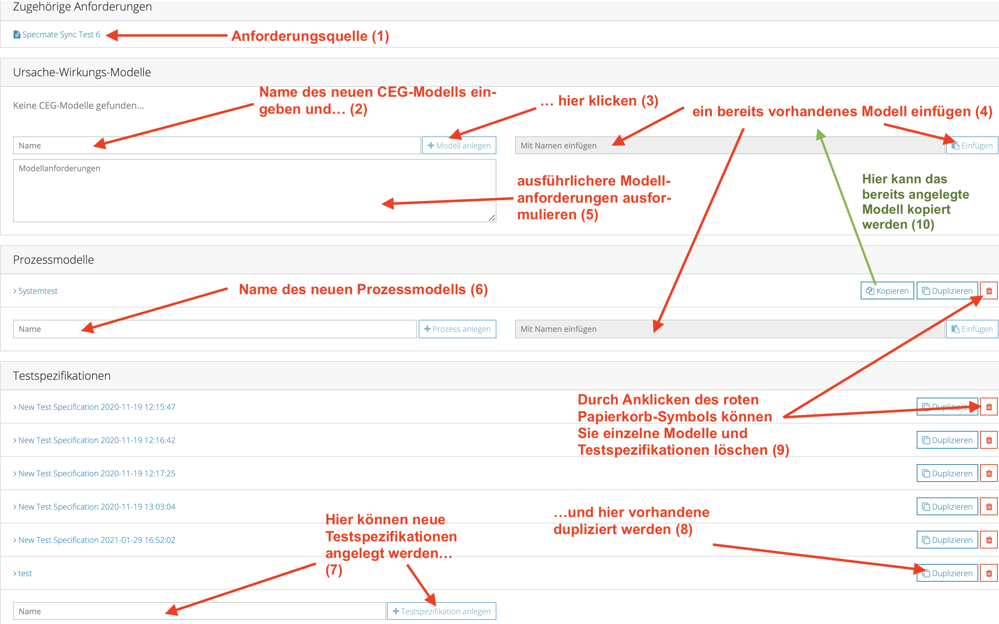

In dieser Ansicht können Sie alle Informationen über die Anforderungen einsehen, sowie zugehörige Modelle bzw. Testspezifikationen erstellen oder bereits erstellte Modelle bzw. Testspezifikationen einsehen.

### Bibliotheksansicht

Die Bibliothek ist Ihr "Baukasten" für Modelle. Hier können Sie Modelle oder Teile von Modellen, welche Sie häufig verwenden, speichern. Durch [Copy & Paste](#copy-and-paste) können Sie diese Bausteine kopieren und in anderen Modellen einfügen.

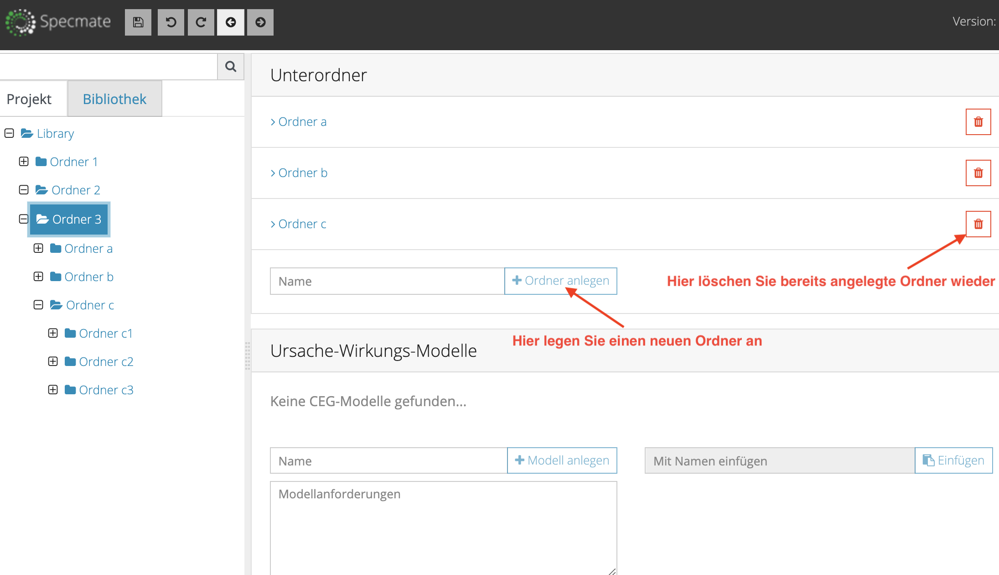

Sie können beliebig viele Ordner, Unterordner, Unterunterordner usw. in der Bibliotheksansicht anlegen und auch wieder löschen. Klicken Sie hierzu auf die von der obigen Abbildung gezeigten Schaltflächen. Genau so können Sie CEGs, Prozessmodelle und Testspezifikationen hier abspeichern. Wie oben bereits beschrieben ist es hier auch möglich nur Teile von komplexeren Modellen, die häufiger verwendet werden, zu speichern.

Wenn ein Ordner in der *Bibliotheks*ansicht ausgewählt ist, wird Ihnen die folgende Ansicht angezeigt:

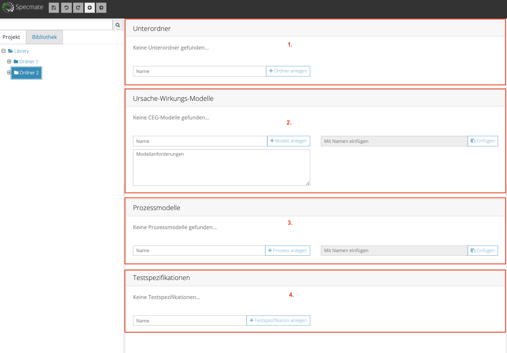

- Im 1. Block können Sie Details über den ausgewählten Ordner abrufen.
- Das Ändern der Struktur der Bibliothek (z.B. Hinzufügen/Entfernen von Ordnern) kann in diesem ersten Block "Unterordner" vorgenommen werden.
- Die Ordnerstruktur auf oberster Ebene der Bibliothek wird in der Projektkonfiguration vorgegeben und kann somit nicht selbst in Specmate geändert werden.
- Das Erstellen von Ursache-Wirkungs-Diagrammen (2.) oder Prozessmodellen (3.) können Sie im jeweiligen Abschnitt durchführen.
- Im 4. Block können Sie eine neue Testspezifikation anlegen.

### Suche

- Specmate zeigt erst dann passende Suchergebnisse, wenn Sie mindestens zwei Zeichen in das Suchfeld eingegeben haben.
- Es werden nur Suchergebnisse aus dem Projekt angezeigt, in das Sie eingeloggt sind.
- Anforderungen oder Testprozeduren werden angezeigt, wenn der Suchbegriff als Präfix im Namen, in der Beschreibung oder der ID der Anforderung oder Testprozedur vorkommt (ab zwei Zeichen).
- Specmate unterstützt auch *Wildcard-Suchen*, nämlich
	- die Wildcard-Suche mit "\*": dabei findet die Suche alle Begriffe die durch das Ersetzen von "\*" mit keinem oder mehreren Zeichen entstehen. Der Suchbegriff "B\*äche" findet also Begriffe wie "Bäche" oder "Bedienoberfläche".
	- die Einzelzeichen-Wildcard-Suche mit "?":  die Suche findet dabei zum Beispiel bei der Eingabe "te?t", die Begriffe "test" und "text".
	- Die Symbole "\*" und "?" können allerdings nicht am Anfang eines Suchbegriffs eingesetzt werden.

# Modell erstellen

In der [Projektansicht](###Projektansicht) können Sie alle Informationen über die Anforderung einsehen
und zugehörige Modelle erstellen oder bereits erstellte Modelle einsehen.

## Wie entscheiden Sie, welches Modell zu erstellen ist?

Für das Modellieren von Anforderungen haben Sie die Wahl zwischen
[Ursache-Wirkungs-Diagrammen (CEG)](###Editor-Funktionen-im-CEG-Editor) und [Prozessmodellen](###Editor-Funktionen-im-Prozessmodell-Editor). Je nachdem, ob die Art der Anforderung

- regelbasiert ("Wenn dies und das, dann das Folgende... mit Ausnahme von ... dann...") oder
- prozessbasiert ("Zuerst gibt der Benutzer A ein.  Aufgrund der Eingabe gibt das System entweder B oder C ein. Danach fragt das System den Benutzer nach D, danach...") ist,

können Sie die entsprechende Modellierungstechnik auswählen. Bei der Modellierung regelbasierter Anforderungen werden Ursache-Wirkungs-Diagramme verwendet, während prozessbasierte Anforderungen mit Prozessmodellen dargestellt werden können.

## Grundlegende Editorfunktionen für CEGs und Prozessmodelle

In diesem Abschnitt lernen Sie die grundlegenden Editorfunktionen sowohl für CEG- als auch für Prozessmodelle kennen.
Wenn Ihnen die jeweilige Erklärung nicht ausreicht oder Sie einen erweiterten Anwendungsbereich kennenlernen wollen, lesen Sie bitte die ausführlicheren Erläuterungen im Abschnitt [Erweiterte Funktionen und Erläuterungen zum Ursache-Wirkungs-Diagramm](##Erweiterte-Funktionen-und-Erläuterungen-zum-Ursache-Wirkungs-Diagramm) oder im Abschnitt [Erweiterte Funktionen und Erläuterungen zum Prozessdiagramm](##Erweiterte-Funktionen-und-Erläuterungen-zum-Prozessdiagramm) nach.
Falls Sie nur einzelne Aspekte genauer nachlesen wollen, klicken Sie einfach auf die verlinkten Begriffe und springen Sie so zu der erweiterten Erläuterung weiter unten in dieser Anleitung.

### Editor-Funktionen im CEG-Editor

Wenn Sie sich in der Projektansicht dazu entschieden haben, Ihre Anforderungen in einem CEG-Modell umzusetzen, gelangen Sie in den CEG-Editor. Hier stellt Specmate Ihnen verschiedene Werkzeuge zur Verfügung, um Ihre CEGs zu modellieren.

Auf dieser Abbildung sehen Sie die Schaltflächen, die Sie verwenden müssen, um

1. einen oder mehrere Knoten durch Drag & Drop hinzuzufügen.
2. einen verknüpften Knoten hinzufügen
3. die Knoten durch Klicken auf den kleinen Strukturbaum bündig anzuordnen (Auto-Layout)
4. die Hilfslinien ein- und auszublenden.
5. das Editorfeld in der Ansicht zu maximieren.

#### 1. Knoten

Klicken Sie auf den Text "Knoten", wie im Bild gezeigt, und ziehen Sie den Text "Knoten" in das mit Hilfslinien versehene Editor-Feld. Der so gesetzte Knoten erscheint hier jetzt als Rechteck im Modellierungsbereich.

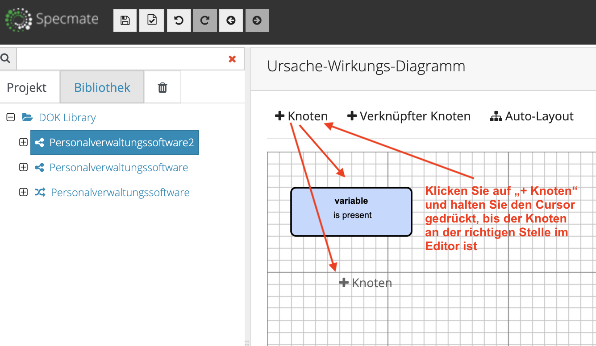

Außerdem können Sie hier

- Knoten per Drag & Drop neu anordnen,
- Knoten per Copy & Paste kopieren,
- Knoten in ihrer Größe verändern: Wählen Sie einen Knoten per Mausklick aus. An den Rändern des Knotens erscheinen kleine grüne Quadrate. Wenn Sie den Mauszeiger über eines dieser Quadrate bewegen, wird der Cursor zu einem Doppelpfeil und Sie können nun die Größe des Knotens beliebig variieren,
-  eine freie Stelle im Editor anklicken und so die Eigenschaften des gesamten Modells bearbeiten.

Wenn Sie noch mehr zu den verschiedenen Knotenarten und ihren Bedingungen erfahren wollen, lesen Sie [hier](###Knoten:-Arten-und-Bedingungen) weiter.

#### 2. Verknüpfte Knoten

Bewegen Sie den Cursor über das Werkzeug "verknüpfter Knoten" und ziehen sie den Knoten – wie bei der Erstellung eines normalen Knotens – in den Modellierungsbereich. Es erscheint jedoch kein Knoten, sondern es wird Ihnen ein Fenster angezeigt. Geben Sie im Abschnitt "Schritt 1" in die Suchmaske den Namen des Modells ein, das Sie in Ihr Basis-Modell integrieren möchten. Wenn Sie mindestens zwei Zeichen in die Suchmaske eingegeben haben, schlägt Ihnen Specmate passende Modelle vor. Haben Sie bei "Schritt 1" ein Modell ausgewählt, zeigt Specmate Ihnen unter "Schritt 2" mögliche Knoten an. Es werden nur Zielknoten des zu integrierenden Modells angezeigt.
In Ihrem Basismodell erscheint nun die Verknüpfung als einzelner Knoten, der genau wie andere Knoten des Modells mit anderen Knoten verbunden werden kann.

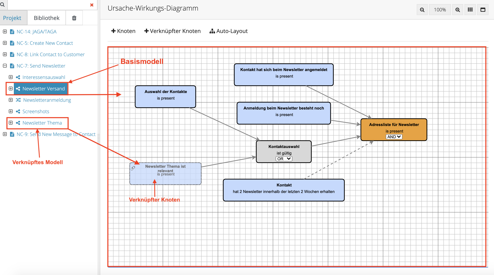

Weitere Erläuterungen hierzu können Sie im Abschnitt [hier](##Rekurrenzen_im_CEG-Modell) nachlesen.

#### 3. Auto-Layout

Durch das Anklicken des kleinen Strukturbaums können Sie ihre Knoten bündig horizontal oder vertikal von Specmate anordnen lassen, wie auf den folgenden Bildern zu erkennen ist:

Vorher:

Nachher:

Sie können das Auto-Layout durch das Anklicken des "Rückgängig-Buttons" (oben links) auch widerrufen.

#### 4. Hilfslinien (Gitter) ein- und ausblenden

Wenn Sie die Hilfslinien (Gitter) ein- oder ausblenden wollen, klicken Sie auf die Schaltflächen oben rechts.

#### 5. Modellierungsbereich maximieren und vergrößern

Wenn Sie den Modellierungsbereich maximieren wollen, klicken Sie auf die Schaltflächen oben rechts. Wenn Sie einen Knoten oder eine Verbindung in den Bereich des Modellierungsbereichs ziehen, der für Sie nicht mehr sichtbar ist, vergrößert sich der Modellierungsbereich automatisch; es erscheinen Scroll-Balken, mithilfe derer Sie sich horizontal und vertikal durch den Modelleditor bewegen können.

#### 6. Verbindungen erstellen

Bewegen Sie Ihren Cursor auf den von Ihnen bereits erstellten Knoten: Es erscheint ein grau umrandeter Pfeil innerhalb Ihres Knotens. Nun können Sie den Knoten mit einem anderen Knoten verbinden, indem Sie mit gedrückter Maustaste die Verbindung vom ersten zum zweiten Knoten ziehen.

1.) Bewegen Sie Ihren Cursor über einen Knoten: Es erscheint ein grau umrandeter Pfeil in der Knotenmitte; klicken Sie auf diesen Pfeil und halten Sie die Maustaste gedrückt, während Sie die Verbindung zu einem anderen Knoten ziehen:
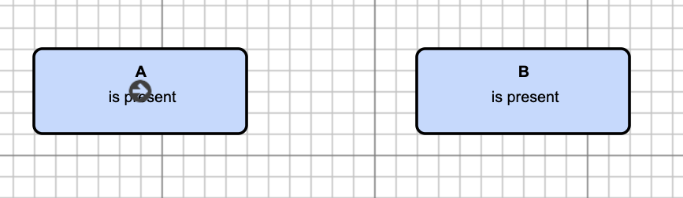

2.) Während Sie eine Verbindung ziehen, ist jene als grün gestrichelte Linie visualisiert; fertige Verbindungen sind als schwarze Pfeile dargestellt. Der Ausgangsknoten erscheint während des Verbindens auch in grün-schwarz gestrichelter Umrandung.

3.) Durch klicken auf die grünen Kästchen auf der Umrandung des Knotens, können Sie jenen vergrößern oder verkleinern. Durch das Anklicken des Knotens können Sie, wenn Ihr Cursor als Handsymbol erscheint, Knoten verschieben. Der Zielort und die Zielgröße werden ebenfalls grün gestrichelt angezeigt:

4.) Sie können Verbindungen außerdem negieren, wenn Sie genaueres dazu wissen wollen, lesen Sie [hier](###Verbindungen-negieren) weiter.

#### 7. Markieren
Wenn Sie mehrere Verbindungen und/oder Knoten auswählen wollen, weil Sie z.B. einen Teil Ihres Modells kopieren und/oder in der Bibliothek abspeichern wollen, halten Sie die Strg-Taste (Windows) oder die Command-Taste (Mac) gedrückt, während Sie auf die gewünschten Elemente klicken.

#### 8. Fehlermeldungen und Warnungen

Für alle Fehlermeldungen, die durch ein dreieckig gerahmtes Ausrufezeichen visualisiert werden, gilt: Bewegen Sie Ihren Cursor über das Symbol, wird Ihnen in einem kleinen Fenster der Grund für die Fehlermeldung angezeigt. Beheben Sie den Fehler und klicken Sie anschließend auf den Validieren-Button oben links, damit die Fehlermeldung verschwindet.
Bei einem fehlerhaften Modell werden Ihnen die Fehler nicht nur lokal im Modell angezeigt, sondern auch in der Spalte „Eigenschaften“ unter der Überschrift „Fehler & Warnungen“ auf der rechten Seite. Wenn Sie der Meinung sind, dass Sie den Grund für die hier angezeigte Fehlermeldung bereits behoben haben, klicken Sie oben links im Editorbereich auf den Validieren-Button. Weiteres zum Thema Validieren finden Sie [hier](####Validieren). Eine Auflistung verschiedener möglicher Fehler finden Sie [hier](#Fehlermeldungen).

#### 9. Löschen

Löschen können Sie Verbindungen und Knoten über die Entfernen-Taste (Windows) oder indem Sie die Command- und die Löschen-Taste (Mac) gleichzeitig betätigen. Oder Sie klicken die Verbindung mit der rechten Maustaste (Windows) an und wählen "Löschen" in dem Pop-Up, das Ihnen angezeigt wird, aus. Bei Mac klicken Sie auf die Verbindung und halten Sie gleichzeitig die "Control-Taste" gedrückt: Nun können Sie auch die Option "Löschen" im Pop-Up auswählen.

#### 10. Rückgängig machen

Wenn Sie auf der Tastatur die übliche Tastenkombination Strg/CMD + Z drücken, macht Specmate die letzte durchgeführte Aktion wieder rückgängig. Oder klicken Sie auf den Rückgängig-Button oben links.

### Eigenschaften

Auf der rechten Seite des Editors können Sie die *Eigenschaften*,
wie zum Beispiel Namen oder Beschreibungen des Modells und einzelner Knoten und Verbindungen, einsehen und ändern.

### Links & Actions

Im Abschnitt *Links & Actions* können Sie die Beschreibung der Anforderung ansehen, für die Sie gerade ein Modell anlegen. Links zu bereits generierten Testspezifikationen werden ebenfalls angezeigt. [Testspezifikationen](#testspezifikation) und [-prozeduren](#testprozedur) angelegt werden und, wenn anschließend an dieser Stelle exportiert werden.

### Editor-Funktionen im Prozessmodell-Editor

Der Prozessmodell-Editor funktioniert ähnlich wie der CEG-Editor: Anstatt dass man oben links "Knoten" auswählen und in den Modellierungsbereich ziehen kann, gibt es noch differenziertere Möglichkeiten bei den Werkzeugen: Im Prozessmodell muss ein Anfangspunkt (+START) und ein Endpunkt (+ENDE) gewählt werden. Näheres dazu, finden Sie auch [hier](###Start/Ende). (Die Knoten dazwischen werden hier als Schritte bezeichnet und können über das Werkzeug +SCHRITT in den Modellierungsbereich gezogen werden. [Hier](###Schritt) finden Sie noch mehr dazu.) Außerdem gibt es noch das Werkzeug +ENTSCHEIDUNG, das eine Aufspaltung im Prozess visualisiert – [Weiteres zur Entscheidung](###Entscheidung). Die Auto-Layout-Funktion kann auch im Prozess-Editor durch Anklicken des kleinen Strukturbaums verwendet werden.

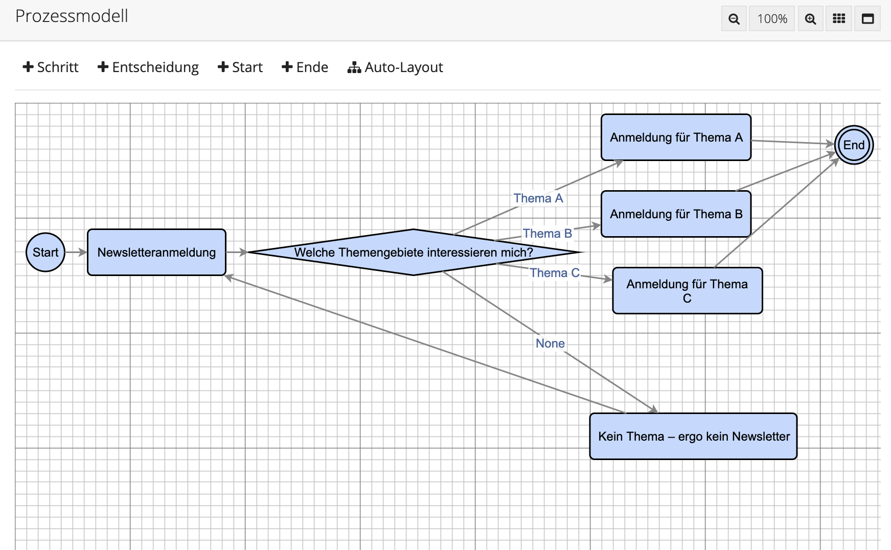

Das Erstellen von Verbindungen erfolgt wie im CEG-Editor dadurch, dass der Cursor über den jeweiligen Knoten (dies gilt auch für den Start- End- und Entscheidungsknoten) bewegt wird; es erscheint ein grau umrandeter Pfeil im Knoten, der durch Klicken der Maustaste als Verbindung zu einem beliebigen Knoten gezogen werden kann. Lediglich die Verbindungen, die von einem Entscheidungsknoten ausgehen, unterscheiden sich dahingehend, dass ihnen eine Bedingung in der rechten Eigenschaftsspalte zugeordnet werden muss. Im Gegensatz zum CEG-Editor können die Knoten nur in der Eigenschaftsspalte und nicht direkt durch das Anklicken eines Knotens benannt werden. Weitere Erläuterungen finden Sie im Abschnitt [Verbindungen im Prozessmodell](###Verbindungen-im-Prozessmodell).

#### Traces

Die Spalte *Traces* zeigt alle Anforderungen, die mit dem ausgewählten Schritt verbunden sind. Traces werden nur in Prozessdiagrammen angezeigt und zwar nur, wenn ein Schritt ausgewählt ist. Darüber hinaus können Sie Anforderungen hinzufügen, indem Sie im Suchfeld nach ihnen suchen. Es kann sowohl nach der ID als auch nach dem Namen der Anforderung gesucht werden. Die angezeigten Anforderungen können dann durch Anklicken zu dem ausgewählten Schritt hinzugefügt werden. Bereits hinzugefügte Anforderungen können durch Anklicken des nebenstehenden roten Papierkorb-Symbols gelöscht werden.

### Copy and Paste

#### Kopieren aus den Editoren

Sie haben in allen Editoren die Möglichkeit das Modell oder Teile davon zu kopieren und in andere Modelle einzufügen. Ziehen Sie hierfür ein Rechteck um den gewünschten Bereich, der kopiert werden soll. Wie zum Beispiel hier:

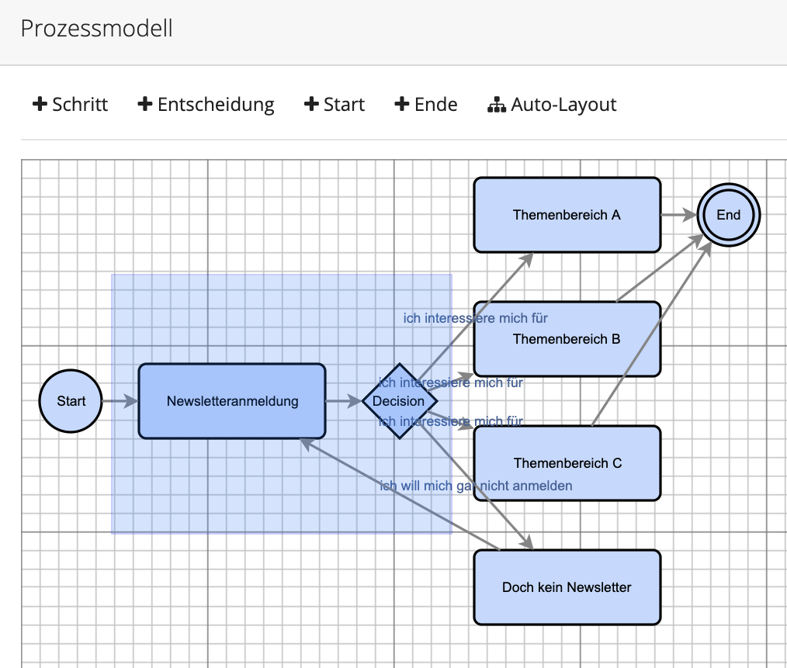

Wenn der Bereich markiert wurde, sind alle markierten Knoten und Verbindungen mit einer grünen durchbrochenen Linie markiert:

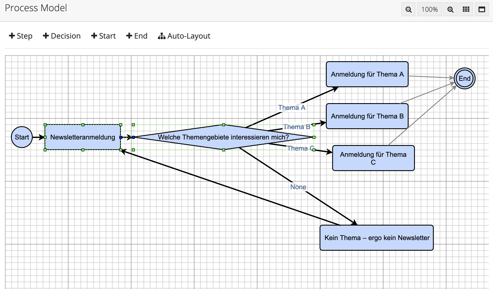

Mit Strg + C (Windows-Tastatur) oder cmd + C (Mac-Tastatur) kopieren Sie den Bereich. Das kopierte Modell kann im gleichen oder in anderen Editoren mit Strg + V (Windows-Tastatur) oder cmd + V (Mac-Tastatur) wieder eingefügt und weiter bearbeitet werden.

#### Kopieren aus der Projekt- oder der Bibliotheksansicht

Sie können auch ganze Modelle kopieren, indem Sie, z.B. in der [Bibliotheksansicht](#bibliothek)
auf den *Kopieren*-Button des gewünschten Modells klicken.

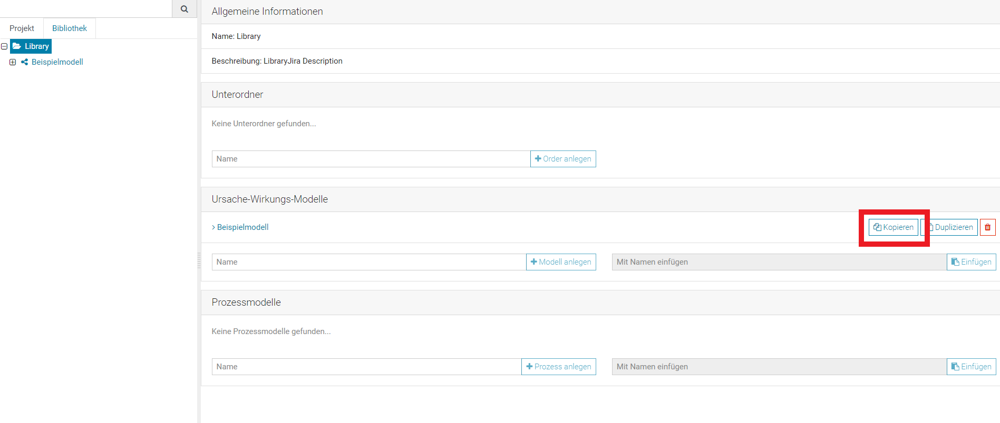

Jetzt können Sie in der Bibliotheks- oder in der Projektansicht eine Kopie des Modells erstellen.

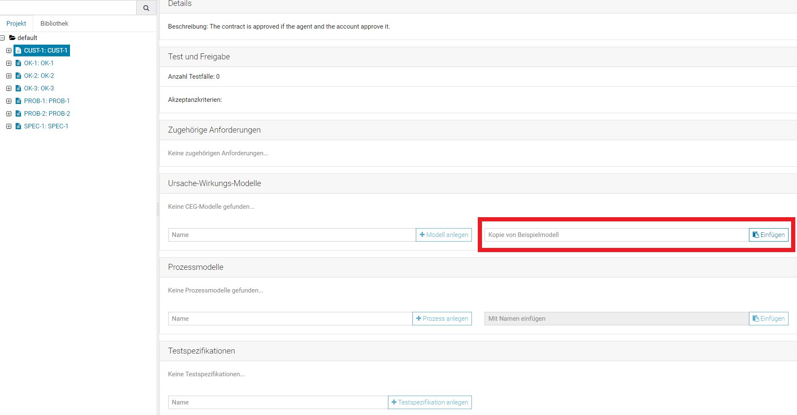

Standardmäßig heißt das neue Modell "*Kopie von [Name des ursprünglichen Modells]*".
Diesen Namen können Sie im Eingabefeld ändern: Indem Sie den *Einfügen*-Knopf anklicken, fügen Sie die Kopie des Modells zum Projekt hinzu.

## Erweiterte Funktionen und Erläuterungen zum Ursache-Wirkungs-Diagramm

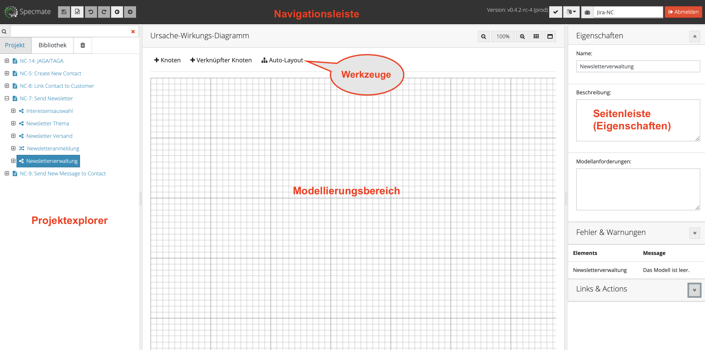

Nach dem Öffnen des Ursache-Wirkungs-Editors wird Ihnen in der Mitte ein Modellierungsbereich präsentiert, in dem Sie Ihr CEG erstellen können. Um ein CEG zu modellieren, können Sie ein Werkzeug oberhalb des Modellierungsbereichs auswählen. Indem Sie auf *Knoten* klicken und die Maustaste gedrückt halten, können Sie den Knoten in den Modellierungsbereich ziehen, um einen neuen Knoten anzulegen. Standardmäßig ist der Name des Knotens *variable* und die Bedingung ist auf *is present* gesetzt. Was mit diesen Begriffen gemeint ist, lesen Sie in den folgenden Abschnitten. Sie können die Attribute des ausgewählten Knotens auf der rechten Seite im Abschnitt [*Eigenschaften*](#Eigenschaften) ändern.

### Verbindung

Um zwei Knoten zu verbinden, gehen Sie wie folgt vor:
Bewegen Sie Ihren Cursor auf den von Ihnen bereits erstellten Knoten, der die Ursache darstellen soll: Es erscheint ein grau umrandeter Pfeil innerhalb Ihres Knotens. Nun können Sie den Knoten mit einem anderen Knoten, der die Wirkung darstellen soll, verbinden, indem Sie mit gedrückter Maustaste die Verbindung vom ersten zum zweiten Knoten ziehen.

####  Verbindungen negieren

*Negieren* negiert die Verbindung zwischen zwei Knoten. Das bedeutet, dass die Wirkung auftritt,
wenn die Ursache nicht vorhanden ist, und die Wirkung bleibt aus, wenn die Ursache vorhanden ist.

Wenn eine Verbindung erstellt und ausgewählt wird, haben Sie außerdem die Möglichkeit die Verbindung zu [negieren](#negieren): Dafür müssen Sie lediglich die zu negierende Verbindung anklicken und in der Eigenschaftsspalte auf der rechten Seite ein Häkchen bei "Negate" setzen. Oder sie klicken mit der rechten Maustaste auf die Verbindung (Windows) bzw. Sie halten die Control-Taste gedrückt, wenn Sie auf die Verbindung klicken (Mac): Es erscheint ein Pop-Up, in dem Sie die Optionen "Löschen" oder "Negieren" auswählen können. Die Verbindung erscheint danach im Editor als gestrichelte Linie (Pfeil), wohingegen eine normale Verbindung als Pfeil mit durchgezogener Linie dargestellt wird.

Wenn Sie überprüfen wollen, ob Ihr CEG-Modell korrekt ist, klicken Sie oben links auf den Validieren-Button und schauen Sie, ob in der Spalte *Eigenschaften* unter der Überschrift *Fehler & Warnungen* etwas angezeigt wird. Ein unbenannter Knoten wird beispielsweise als Fehler angezeigt. Näheres zum Thema Validieren erfahren Sie weiter unten oder [hier](####Validieren).

#### Beschreibung

Zu jeder Verbindung zwischen zwei Knoten können Sie eine *Beschreibung* hinzufügen. Dies kann zum eigenen Verständnis oder dem  einer Kollegin oder eines Kollegen beitragen. Außerdem können Sie – wie bereits oben erläutert – den Typ des Knotens in der Spalte *Eigenschaften* ändern.

Achten Sie darauf, dass der Knoten oder die Verbindung, deren Eigenschaften Sie bearbeiten wollen, vorher angeklickt wurde. Ob dies der Fall ist, erkennen Sie auch an der grüngestrichelten Umrandung, wie die vorausgegangene Abbildung illustriert. Ist keine einzelne Komponente (Knoten oder Verbindung) im Modell angeklickt, werden in der Eigenschaftsspalte die Eigenschaften des gesamten Modells beschrieben.

### Knoten: Arten und Bedingungen

Ein Knoten beschreibt eine Ursache oder eine Wirkung, dabei kann ein Knoten auch jeweils Ursache und Wirkung von einem oder mehreren anderen Knoten sein. Es gibt zwei grundlegende Arten von Knoten:

- Knoten, die nur zwei Ausprägungen/Bedingungen haben können. Also alle Bedingungen, die man mit ja/nein beantworten kann.

Beispiel:
	- Variable: *Führerschein vorhanden*
	- Bedingung: *ja* oder *nein*

- Knoten, die mehr als zwei Ausprägungen/Bedingungen haben können. Beispiel:
	- Variable: *Region*
	- Bedingung: *Europa*, *Afrika*, *Asien*, *Amerika*, ...

Haben mehrere Knoten den gleichen Variablennamen, kann das bei der Testgenerierung zu Schwierigkeiten führen. Dann empfiehlt es sich, den *Istgleich*-Operator anzuwenden. Mehr dazu im Kapitel [Bedingung](####Bedingung).

Im Namen des Knotens dürfen außerdem folgende Zeichen nicht verwendet werden:
- , (Komma)
- ; (Semikolon)
- | (senkrechter Strich)

In der Formulierung der Bedingungen ist  die Verwendung der Zeichen jedoch zulässig.

Haben Sie im Editor einen Knoten ausgewählt, dann haben Sie auf der rechten Seite die Möglichkeit die *Eigenschaften* des Knotens zu ändern. Die folgenden Eigenschaften können bearbeitet werden:

### Variable

Hier können Sie den Namen der Variable ändern, das heißt den Namen der Ursache oder der Wirkung.

### Bedingung

Die Bedingung, die die Variable annehmen kann, ist standardmäßig auf *is present* gesetzt.
Um die Beschreibung des Zustandes zu ändern, wählen Sie bitte den entsprechenden Knoten aus und schreiben die gewünschte Bedingung in das Feld *Bedingung*.

Haben mehrere Knoten den gleichen Variablennamen, kann man Schwierigkeiten bei der Testgenerierung umgehen,
indem man vor die Bedingung ein '=' setzt. Damit teilen Sie Specmate mit, dass nur eine Bedingung der Variable wahr sein kann.
Gibt es zum Beispiel mehrere Knoten mit dem Variablennamen *Region*, kann man als Bedingung zum Beispiel
*=Europa* schreiben. Bei der Testgenerierung wird dann darauf geachtet, dass alle Knoten, die die selben
Variablennamen haben und bei denen die Bedingung mit = gesetzt ist, jeweils immer genau ein Knoten gleichzeitig wahr ist.
Eine bewährte Vorgehensweise ist, die Variablen immer als positive Aussagen zu deklarieren
(z.B. *Türen zugesperrt: wahr* statt *Türen nicht zugesperrt: nicht wahr*).

### Typ And/Or

Wenn ein Knoten mehrere eingehende Verbindungen hat, können Sie den *Typ* des Knotens ändern. Wählen Sie dazu den entsprechenden Knoten aus und ändern Sie auf der rechten Seite unter *Eigenschaften* den *Typ* des Knotens. Abhängig vom Typ des Knotens können eingehende Verbindungen als ODER-Verknüpfungen oder UND-Verknüpfungen definiert werden. Wenn der Typ des Knotens auf AND gesetzt ist, müssen alle Vorgängerknoten
mit einer Verbindung zu dem jeweiligen Knoten bereits erfüllt sein,
damit der Knoten erfüllt wird.

Beispiel für eine UND-Beziehung:

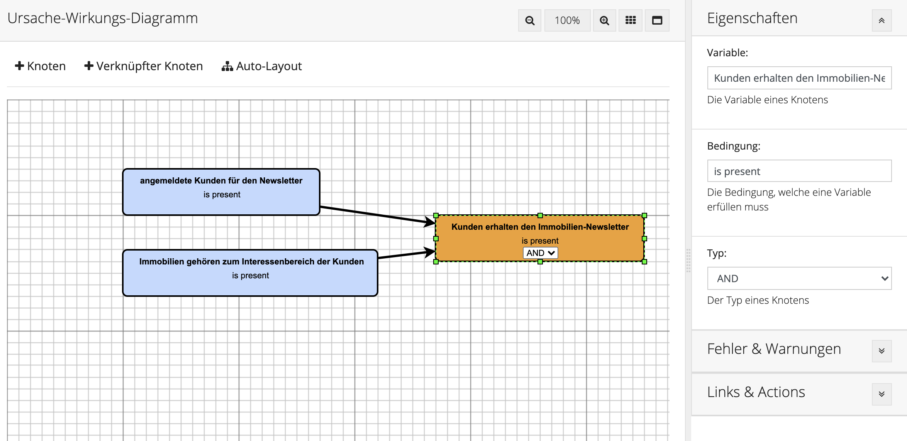

Ist der Typ des Knotens allerdings auf OR gesetzt, muss nur ein einziger direkter Vorgänger erfüllt werden,
damit der Knoten erfüllt wird. Dieses OR ist ein *inklusives Oder*, das heißt es können auch beide Ursachen wahr sein, damit der Knoten erfüllt ist. Nicht zu verwechseln mit einem [exklusiven Oder](#Exklusives-Oder), bei dem *genau eine* Ursache wahr sein muss, damit der Knoten erfüllt ist.

Beispiel für eine ODER-Beziehung:

### Rekurrenzen im CEG-Modell

Um noch komplexere CEGs zu entwerfen, bietet Specmate die Möglichkeit, mehrere CEG-Modelle rekurrent zu verknüpfen.

Kurz gesagt bedeutet das, dass ein Modell (oder mehrere Modelle) in ein anderes Modell integriert werden können. Dafür wird der Zielknoten des integrierten Modells als verknüpfter Knoten in das integrierende Modell eingefügt. So können komplexe Bedingungen ausformuliert werden, ohne dass die Übersichtlichkeit des Modells darunter leidet. Wie das genau geht, soll im Folgenden anhand eines kurzen Beispiels erläutert werden.

Wenn man im Folgenden den Knoten "Newsletter Thema" noch genauer bestimmen will, lässt sich dazu ein gesondertes Modell entwerfen.

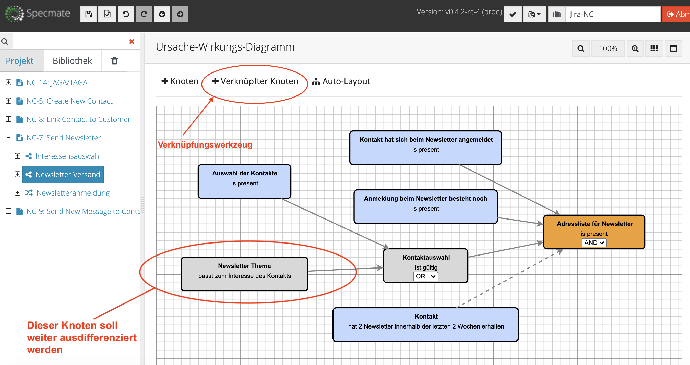

Das folgende Modell würde die Themenauswahl des Newsletters noch etwas genauer bestimmen:

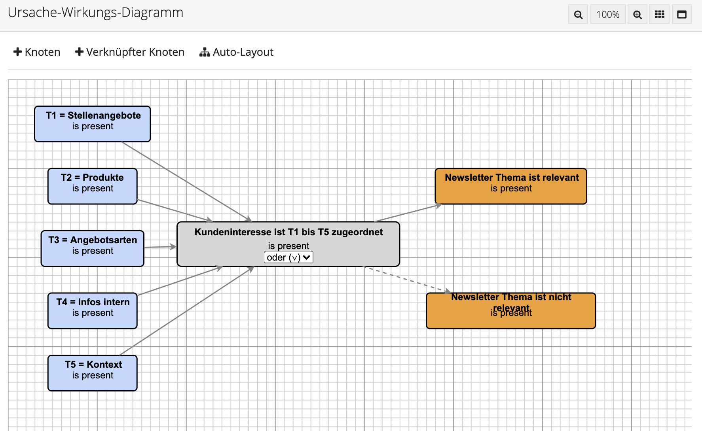

Wenn dieses Modell in das bestehende Basis-Modell integriert werden soll, kann dies mittels des Werkzeugs "verknüpfter Knoten" geschehen. Das Werkzeug heißt "verknüpfter Knoten" und nicht "verknüpftes Modell", weil es immer der Zielknoten des integrierten Modells ist, der mit dem Basismodell verknüpft wird:

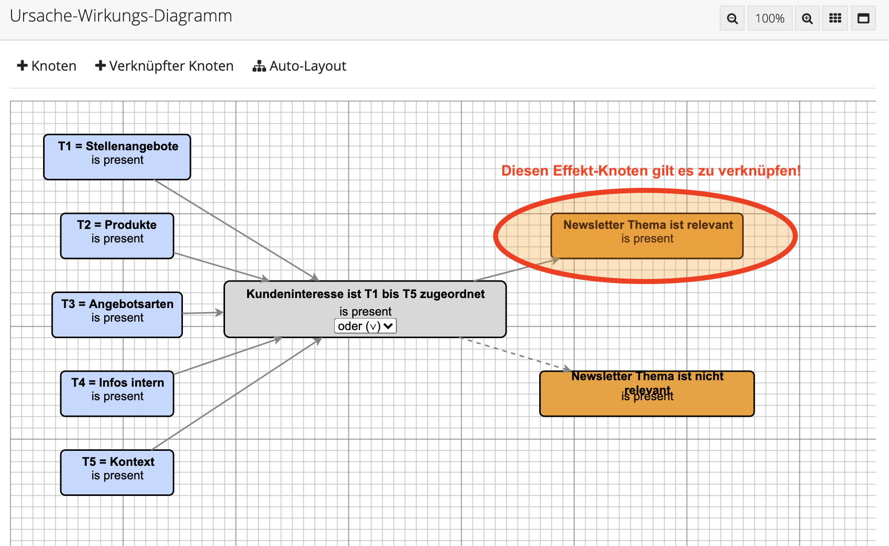

Um eine solche Verknüpfung herzustellen, bewegen Sie den Cursor über das Werkzeug "verknüpfter Knoten" und ziehen sie den Knoten – wie bei der Erstellung eines normalen Knotens – in den Modellierungsbereich. Es erscheint jedoch kein Knoten, sondern es wird Ihnen ein Fenster angezeigt:

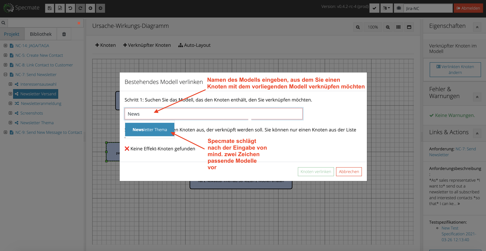

Geben Sie im Abschnitt "Schritt 1" in die Suchmaske den Namen des Modells ein, das Sie in Ihr Basis-Modell integrieren möchten. Wenn Sie mindestens zwei Zeichen in die Suchmaske eingegeben haben, schlägt Ihnen Specmate passende Modelle vor. Haben Sie bei "Schritt 1" ein Modell ausgewählt, zeigt Specmate Ihnen unter "Schritt 2" mögliche Knoten an. Es werden nur Zielknoten des zu integrierenden Modells angezeigt.

In Ihrem Basismodell erscheint nun die Verknüpfung als einzelner Knoten, der genau wie andere Knoten des Modells mit anderen Knoten verbunden werden kann:

### Wichtige Regeln für die Verknüpfung von Modellen
- Wichtig ist, dass Sie nicht versuchen, einen Kreis zu bilden, in dem Modell A auf Modell B verweist und Modell B auf Modell A. Dies führt zu einer Fehlermeldung.
Wenn Sie eine Testspezifikation generieren, erscheint der verknüpfte Knoten als ganz normaler Knoten in der Testspezifikation.
- Es können nur Effekt-Knoten verknüpft werden, die über keine ausgehenden Verbindungen verfügen. In der obigen Abbildung kann der graue Knoten "Kontaktauswahl" nicht verknüpft werden, da er Ursache und Effektknoten ist und von ihm Verbindungen ausgehen. der orangefarbene Knoten "Adressliste für Newsletter" kann hingegen verknüpft werden.
- Es können nur Knoten aus anderen Modellen verknüpft werden.
- Wird der verknüpfte Knoten in dem verknüpften Modell (versehentlich) gelöscht, zeigt Specmate eine Fehlermeldung an.

#### Exkurs Exklusives Oder

Ein *Exklusives Oder*, oder *XOR*, sagt aus, dass *genau eine* Ursache wahr sein muss, um eine Wirkung zu erzielen. Im Deutschen erkennt man ein solches Exklusives Oder an der Formulierung "entweder... oder... (aber nicht beides)".

In Specmate kann das Exklusive Oder leicht konstruiert werden: Hat man zum Beispiel die Aussage "Entweder A, oder B, dann C" können Sie diese Aussage mithilfe von zwei Hilfsvariablen D und E und durch [Negation](#Negieren) modellieren:

Die Aussage wird also umgeschrieben zu "Wenn A und nicht B, oder B und nicht A, dann C".

#### Beschreibung

Zu jeder Verbindung zwischen zwei Knoten können Sie eine *Beschreibung* hinzufügen. Dies kann zum eigenen Verständnis oder dem  einer Kollegin oder eines Kollegen beitragen. Außerdem können Sie – wie bereits oben erläutert – den Typ des Knotens in der Spalte *Eigenschaften* ändern.

Achten Sie darauf, dass der Knoten oder die Verbindung, deren Eigenschaften Sie bearbeiten wollen, vorher angeklickt wurde. Ob dies der Fall ist, erkennen Sie auch an der grüngestrichelten Umrandung, wie die vorausgegangene Abbildung illustriert. Ist keine einzelne Komponente (Knoten oder Verbindung) im Modell angeklickt, werden in der Eigenschaftsspalte die Eigenschaften des gesamten Modells beschrieben.

### Validieren

Wenn Sie ein CEG-Modell oder Prozessmodell anlegen oder angelegt haben, können Sie oben links im Bildschirm neben dem Specmate-Logo eine weitere Schaltfläche erkennen: den *Validieren*-Button. Wenn Sie auf diese Schaltfläche klicken, wird die Prüfung Ihres Modells aktualisiert. Ist ihr Modell korrekt, wird Ihnen in dem Abschnitt *Eigenschaften* unter der Überschrift *Fehler und Warnungen* in grüner Schrift die Meldung "Keine Warnungen." angezeigt. Ist Ihr Modell fehlerhaft, werden hier die Fehler aufgeführt. In diesem Fall müssen Sie den Fehler beheben und erneut auf den *Validieren*-Button klicken. Das Anklicken des *Validieren*-Buttons ist außerdem nötig, um eine spätere Testgenerierung überhaupt möglich zu machen.

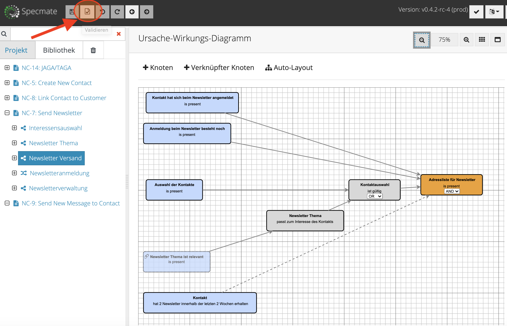

Specmate stellt die Knoten optisch unterschiedlich dar abhängig davon, welche Position sie im CEG-Modell einnehmen, wie in der folgenden Abbildung ersichtlich ist:

## Äquivalenzklassenanalyse

### Motivation und Ziel

Oft ist es ein Problem, aus einer großen Menge an möglichen Werteklassen von Variablen (z.B. Alter einer Person), eine Auswahl geeigneter Werteklassen zu ermitteln. Durch die Auswahl einiger weniger Werteklassen entscheidet sich der Tester, viele Situationen nicht zu testen. Deshalb ist es wichtig, dass diese Auswahl sehr sorgfältig geschieht. Die Auswahl an Werteklassen sollte im Idealfall möglichst viele Situationen abdecken. Dabei hilft die *Äquivalenzklassenanalyse*.

Ziel der Bildung von Äquivalenzklassen ist es, eine hohe Fehlerentdeckungsrate mit einer möglichst geringen Anzahl von Testfällen zu erreichen. Die Äquivalenzklassen sind also bezüglich der Ein- und Ausgabedaten ähnliche Klassen bzw. Objekte, bei denen erwartet wird, dass sie sich gleichartig verhalten. Jeder Wert einer Äquivalenzklasse ist folglich ein geeigneter repräsentativer Stellvertreter für alle Werte der Äquivalenzklasse.

#### Beispiel 1

Oft sind Äquivalenzklassen eindeutig zu ermitteln. Eine Anforderung könnte zum Beispiel lauten

Der Roboassistent für den Handel mit Wertpapieren wird beauftragt, Aktien eines bestimmten Unternehmens A zu verkaufen, wenn diese einen bestimmten Wert z.B. 14€ erreicht oder überschritten haben.

Hier lauten die Äquivalenzklassen für die Eingabevariable *Größe*:

- Äquivalenzklasse 1: >14€
- Äquivalenzklasse 2: <=14€

Und für die Ausgabevariable *verkaufen*:

- Äquivalenzklasse 1: verkaufen
- Äquivalenzklasse 2: nicht verkaufen

Das dazugehörige CEG-Modell würde dann so aussehen:

Im Allgemeinen gilt:

> Hat eine Variable *n* Ausprägungen, benötigt das Modell *n-1* Knoten.

#### Beispiel 2

Das *Beispiel 1* kann zu folgender Anforderung weiterentwickelt werden:

> Der Robo-Assistent soll die Aktien von Unternehmen A verkaufen, wenn sie den Wert von 14€ erreicht oder übertroffen haben. Liegt der Wert der Aktien jedoch längere Zeit zwischen 12€ und 13,99€ dürfen die Aktien auch verkauft werden, wenn Aktien des Unternehmens B gekauft wurden.

Hier lauten die Äquivalenzklassen für die Eingabevariable *Größe*:

- Äquivalenzklasse 1: *>14€*
- Äquivalenzklasse 2: *12€< Wert <= 14€*
- Äquivalenzklasse 2: *<12€*

Es gibt hier eine zweite Eingabevariable, nämlich *Kauf von Aktien Unternehmen B*. Hier lauten die Äquivalenzklassen:

- Äquivalenzklasse 1: *B-Aktien gekauft*
- Äquivalenzklasse 2: *B-Aktien nicht gekauft*

Die Ausgabevariable *Aktien verkaufen* bleibt gleich.

Es empfiehlt sich hier eine Zusatzvariable *Übergangszeit* einzuführen, die eintritt, wenn die Aktie A weniger als 14€, aber nicht weniger als 12€ wert ist. Das zugehörige CEG-Modell sieht dann wie folgt aus:

## Erweiterte Funktionen und Erläuterungen zum Prozessdiagramm

Um Prozessmodelle zu modellieren, öffnen Sie zunächst den zugehörigen Editor. Mit dem [*Schritt*](#schritt)-Werkzeug können Sie dem Modell eine Aktion hinzufügen.
Jedes Modell muss einen Startknoten und mindestens einen Endknoten haben.

Sie fügen dem Modell einen Entscheidungsknoten hinzu, indem Sie das Werkzeug
[*Entscheidung*](#entscheidung) auswählen.

Um zwei Elemente zu verbinden, müssen Sie sich – wie beim CEG-Modell – mit dem Cursor über einen Knoten bewegen und, sobald der grau umrandete Pfeil erscheint, den Cursor gedrückt halten und die Verbindung zu einem beliebigen anderen Element ziehen. Für jede Verbindung können Sie eine Bedingung setzen, die der vorangegangene Knoten erfüllen muss. Bei der Verwendung des Entscheidungsknotens können Sie die Bedingungen der ausgehenden Verbindungen angeben, die erfüllt werden müssen, um der spezifischen Verbindung im Modell zu folgen. Wenn ein Knoten ausgewählt ist, zeigt Specmate die Eigenschaften des Knotens auf der rechten Seite an. Außerdem können Sie das erwartete Ergebnis dieses Schrittes im Eigenschaftsbereich im Abschnitt "Beschreibung" angeben.

Die folgende Abbildung zeigt den Prozess eines Geldautomaten,
der mit dem Prozessmodell-Editor modelliert wurde:

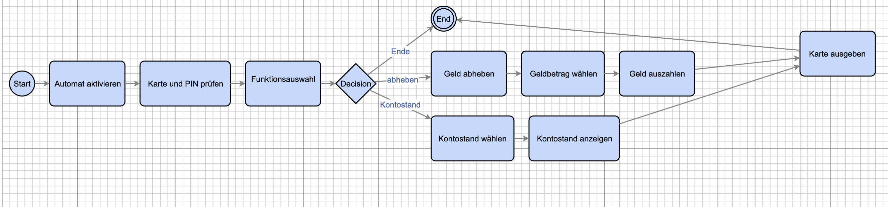

### Start/Ende

*Start* und *Ende* beschreiben den Start und das Ende der Prozedur. Es kann in einer Prozedur nur einen Startknoten geben, allerdings können mehrere Endknoten angegeben werden.

### Schritt

Ein *Schritt* beschreibt eine Aktion, die ausgeführt werden soll. Ist ein Schrittknoten ausgewählt, haben Sie die Möglichkeit den *Namen* des Schritts, also die Aktion, die durchgeführt werden soll, zu ändern, eine *Beschreibung* hinzuzufügen und das zu erwartende Ergebnis des Schritts anzugeben.

### Entscheidung

Eine *Entscheidung* ist ein Schritt, der mehrere Ausgänge haben kann. Ist ein Entscheidungsknoten ausgewählt, können Sie den *Namen* der Entscheidung ändern, das heißt, dass Sie ändern, welche Entscheidung getroffen werden muss. Außerdem können Sie eine *Beschreibung* des Knotens hinzufügen.

### Verbindungen im Prozessmodell

Eine *Verbindung* beschreibt einen Übergang von einem Knoten zum nächsten. Ein *Schritt* kann nur einen Ausgang haben, also nur eine ausgehende Verbindung. Eine *Entscheidung* kann allerdings mehrere Ausgänge und deshalb auch mehrere ausgehende Verbindungen haben. *Schritt* und *Entscheidung* können jeweils mehrere eingehende Verbindungen haben. Ist eine *Verbindung* ausgewählt, können Sie die *Bedingung* angeben, die der vorangegangene Knoten angenommen hat. Außerdem können Sie eine *Beschreibung* hinzufügen.

### Validieren im Prozessmodell

Auch Ihre Prozessmodelle können Sie mittels des *Validieren*-Buttons überprüfen. Wenn Sie auf diese Schaltfläche klicken, wird die Prüfung Ihres Modells aktualisiert. Ist ihr Modell korrekt, wird Ihnen in dem Abschnitt *Eigenschaften* unter der Überschrift *Fehler und Warnungen* in grüner Schrift "Keine Warnungen." angezeigt. Ist Ihr Modell fehlerhaft, wird hier der Fehler aufgeführt. In diesem Fall müssen Sie den Fehler beheben und erneut auf den *Validieren*-Button klicken.
Eine Auflistung verschiedener möglicher Fehler finden Sie im nachfolgenden Abschnitt.

# Fehlermeldungen

Im Folgenden finden Sie die entsprechenden Ursachen, wenn Ihnen Specmate eine Fehlermeldung anzeigt. Für alle Fehlermeldungen, die durch ein dreieckig gerahmtes Ausrufezeichen im Modell-Editor visualisiert werden, gilt: Bewegen Sie Ihren Cursor über das Symbol, wird Ihnen in einem kleinen Fenster der Grund für die Fehlermeldung angezeigt.

## 1. Fehlermeldungen bei Prozessmodellen

Wird Ihnen im Prozessmodell-Editor eine Fehlermeldung angezeigt, überprüfen Sie, ob eines der folgenden Szenarien für Sie zutrifft:

- Für eines der Modellelemente oder das Modell wurde kein Name vergeben.
- Es ist mehr oder weniger als genau ein Startknoten vorhanden.
- Es gibt keinen Endknoten.
- Es gibt Knoten ohne eingehende Verbindung(en).
- Es gibt Knoten ohne ausgehende Verbindung(en).
- Es sind keine Aktivitätsknoten vorhanden.
- Für die ausgehenden Verbindungen eines Entscheidungsknotens sind keine Bedingungen angegeben.
- Ein Startknoten besitzt eine oder mehrere eingehende Verbindungen.
- Ein Startknoten besitzt mehr als eine ausgehende Verbindung.
- Ein Aktivitätsknoten besitzt mehr als eine ausgehende Verbindung.
- Ein Endknoten besitzt eine oder mehrere ausgehende Verbindungen.
- Ein Entscheidungsknoten besitzt nur eine ausgehende Verbindung.
- Es gibt einen Knoten mit leeren Variablennamen.

Trifft eines oder mehrere dieser Szenarien für Ihr Prozessmodell zu, beheben Sie die Fehlerquelle und drücken Sie auf den Validieren-Button.

## 2. Fehlermeldungen bei CEG-Modellen

Wird Ihnen im CEG-Modell-Editor eine Fehlermeldung angezeigt, überprüfen Sie, ob eines der folgenden Szenarien für Sie zutrifft:

- Für eines der Modellelemente oder das Modell wurde kein Name vergeben.
- Für einen oder mehrere Knoten ist/sind keine Bedingung(en) angegeben.
- Es gibt Knoten ohne eingehende oder ausgehende Verbindungen.
- Das Modell ist leer und besitzt keine Knoten.
- Es gibt identische Variablennamen für Wirkungs- und Ursache-Knoten.
- Es gibt einen Knoten mit leeren Variablennamen.
- Bei verknüpften Knoten: das verknüpfte Modell verweist gleichzeitig auf das verknüpfende Modell (Kreis).

Trifft eines oder mehrere dieser Szenarien für Ihr CEG-Modell zu, beheben Sie die Fehlerquelle und klicken Sie erneut auf den Validieren-Button.

# Testspezifikation

Sie haben die Möglichkeit eine Testfall-Spezifikation manuell zu erstellen oder automatisch aus einem Modell zu generieren. Anhand des Symbols der Spezifikation im Projekt-Explorer können Sie sehen, ob sie automatisch oder manuell generiert wird.

Automatisch generiert: 

Manuell erstellt: 

Der Name der Testfall-Spezifikation basiert auf dem Datum und der Uhrzeit, zu der die Spezifikation angelegt wurde. Sie haben die Möglichkeit den Namen der Spezifikation zu ändern und eine Beschreibung hinzuzufügen.

## Testspezifikation aus CEG-Modellen

Die Spezifikation besteht aus mehreren Testfällen, wobei jeder Testfall eine bestimmte Konfiguration hat. Ein Testfall weist jeder Variable einen Wert zu. In bestimmten Testfällen lässt Specmate den Wert einer Variable frei. Ist dies der Fall, ist die Variable nicht auf einen bestimmten Wert beschränkt. Für die Erstellung der Spezifikation werden Regeln verwendet, um ein optimales Verhältnis zwischen Testabdeckung und Anzahl der Testfälle sicherzustellen. Dadurch wird verhindert, dass die Anzahl der Testfälle bei einem Zuwachs der Ursachen exponentiell wächst.

Es kann vorkommen, dass inkonsistente Tests erzeugt werden, bei denen Specmate nicht alle Testerzeugungsregeln erfüllen konnte oder dass das Modell auf eine andere Art widersprüchlich ist: zum Beispiel weil sich die Bedingungen der Variablen wegen des
[*=-Operators*](#bedingung) widersprechen. Specmate zeigt inkonsistente Tests an, indem es diese Tests rot hinterlegt. Überprüfen Sie in diesem Fall Ihr Modell oder passen Sie Ihre Testfälle an.
- Haben zwei oder mehr CEG-Knoten die selbe Variable und beginnt die Bedingung mit Zeichen "=", dann erzeugt Specmate die Testfälle so, dass bei jeden Testfall genau *einer* der Knoten wahr ist.

Beispiel:
Knoten 1: Währung = EUR
Knoten 2: Währung = DOLLAR

Die Knoten, die sich in der Spalte *Eingabe* befinden, sind Variablen, die die Ursachen aus dem Modell darstellen. Das sind alle Knoten, die keine eingehenden Verbindungen haben.
Unterhalb der Spalte *Ausgabe* finden Sie die Variablen, die die Wirkungen darstellen. Das sind alle Knoten, die keine ausgehenden Verbindungen haben. Sie können auch manuell weitere Ein- und Ausgabevariablen hinzufügen oder bestehende löschen. Außerdem können Sie die einzelnen Testfälle manuell per Drag & Drop neuanordnen.

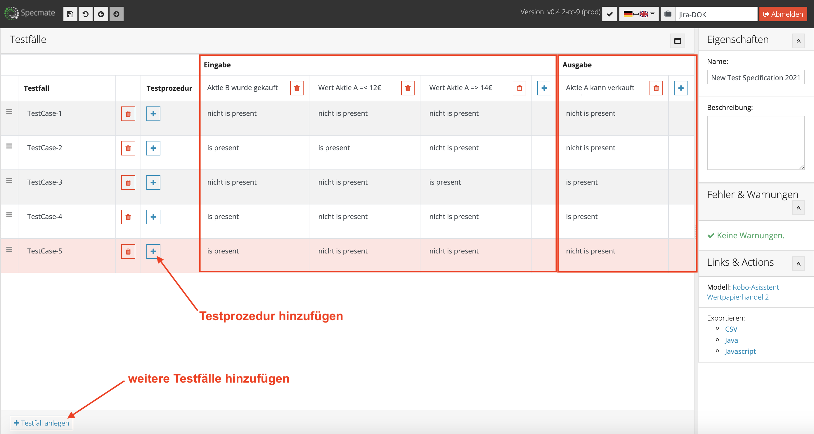

Sie können einen Testfall auch löschen, wenn Sie auf das Papierkorbsymbol des jeweiligen Testfalls klicken. Wenn Sie Testfälle manuell hinzufügen möchten, können Sie die Schaltfläche *Testfall anlegen* im unteren Bereich drücken. Die Reihenfolge der Testfälle kann per Drag & Drop geändert werden.

### Regeln zur Erzeugung von Testspezifikationen

- Ist der Wirkungsknoten *wahr* und der Typ der Eingabeknoten AND, gibt es nur eine Kombination von Eingabeknoten. Nämlich: alle Eingabeknoten sind *wahr*.
- Ist der Wirkungsknoten *falsch* und der Typ der Eingabeknoten AND, werden nur Kombinationen getestet, bei denen genau ein Eingabeknoten *falsch* ist und alle anderen *wahr*.
- Ist der Wirkungsknoten *wahr* und der Typ der Eingabeknoten OR, werden nur Kombinationen getestet, bei denen genau ein Eingabeknoten *wahr* ist und alle anderen *falsch*.
- Ist der Wirkungsknoten *falsch* und der Typ der Eingabeknoten OR, gibt es nur eine Kombination von Eingabeknoten. Nämlich: alle Eingabeknoten sind *falsch*.

## Testspezifikation aus Prozessmodellen

Die Spezifikation besteht aus mehreren Testfällen, wobei jeder Testfall eine bestimmte Konfiguration hat. Ein Testfall weist jedem Entscheidungsknoten eine der verfügbaren Entscheidungen zu und setzt diese Entscheidung dann entsprechend auf *true*.
Für die Erstellung der Spezifikation werden Regeln verwendet, um ein optimales Verhältnis zwischen Testabdeckung und Anzahl der Testfälle sicherzustellen. Auch hier können Sie weitere Testfälle oder Entscheidungen hinzufügen oder vorhandene löschen. Sie können die Reihenfolge der Testfälle per Drag & Drop verschieben.

# Testprozedur

Für jeden Testfall können Sie eine Testprozedur anlegen. Hier können Sie alle notwendigen Schritte für den jeweiligen Testfall definieren. Bei der Modellierung eines CEGs muss die Testprozedur manuell hinzugefügt werden. Das Erzeugen einer Testfall-Spezifikation aus einem Prozessdiagramm führt zu automatisch erstellten Testprozeduren.

Sie können die bereits automatisch erstellte Testprozedur (Prozessdiagramm) ansehen, indem Sie auf das blaue Kästchen mit nummerierter Aufzählung klicken, wie auf der folgenden Abbildung ersichtlich:

Klicken Sie bei einem CEG auf dieses Kästchen, können Sie hier Ihre Testprozedur anlegen. Klicken Sie auf die untere Schaltfläche *Testschritt anlegen*, um weitere Testfälle manuell hinzuzufügen. Um diese umzubenennen, klicken Sie auf den automatisch erstellten Namen des Testfalls (TestCase-1, TestCase-2...).

Testprozeduren können (wie auch Testspezifikationen) exportiert werden.
In jedem Schritt des Testverfahrens können Sie auf Parameter aus dem erstellten Modell verweisen. Die Parameter aus dem Modell können in der Parameterzuordnung auf einen bestimmten Wert eingestellt werden.
Wenn die Erstellung einer Testprozedur abgeschlossen ist, können Sie sie mit der Schaltfläche *Testprozedur exportieren* auf der rechten Seite z.B. nach Jira XRay Cloud exportieren und sie dort weiter bearbeiten. Bevor Sie eine Testprozedur exportieren, ist es essentiell, dass Sie diese vorher speichern. Sie können auch eine bereits erstellte Testprozedur öffnen und bearbeiten, indem Sie sie im [Projekt-Explorer](#bedienoberfläche) oder in der [Anforderungsübersicht](#traces) anklicken.

# Export von Testspezifikationen und -prozeduren

Specmate erlaubt den Export von [Testspezifikationen](#testspezifikation) und [-prozeduren](#testprozedur) auf unterschiedliche Art und Weise und in verschiedenen Formaten.

## Export von Testspezifikationen

Testspezifikationen können in Specmate in drei Formaten exportiert werden:

- als CSV-Datei
- als Java-Testhüllen
- als JavaScript-Testhüllen

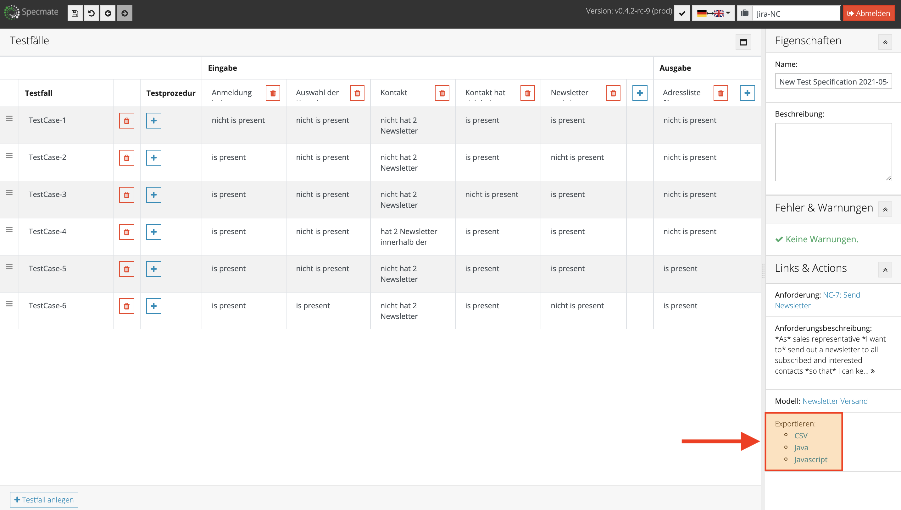

Die Parameterzuordnung bei den Testschritten kann im CSV-Format exportiert werden oder direkt nach Atlassian JIRA:

Sollten Sie sich für einen **Export als CSV** entscheiden, dann sieht die exportierte Testspezifikation folgendermaßen aus:

`"TC";"INPUT - Aktie B wurde gekauft";"INPUT - Wert Aktie A =< 12€";"INPUT - Wert Aktie A => 14€";"OUTPUT - Aktie A kann verkauft werden"
TestCase-1;"nicht is present";"nicht is present";"nicht is present";"nicht is present"
TestCase-2;"is present";"is present";"nicht is present";"nicht is present"
TestCase-3;"nicht is present";"nicht is present";"is present";"is present"
TestCase-4;"is present";"nicht is present";"nicht is present";"is present"
TestCase-5;"is present";"nicht is present";"nicht is present";"nicht is present"
New Test Case 2021-05-05 11:05:58;;;;`

Sollten Sie sich für einen **Export als JAVA** entscheiden, dann sieht die exportierte Testspezifikation folgendermaßen aus:

`import org.junit.Test;
import org.junit.Assert;

/*
 * Datum: 2021-05-05 13:51
 */

public class New_Test_Specification_2021_05_05_10_38_15Test {

	/*
	 * Testfall: TestCase-1
	 */
	@Test
	public void New_Test_Specification_2021_05_05_10_38_15Test___Aktie_B_wurde_gekauft__nicht_is_present___Wert_Aktie_A____12___nicht_is_present___Wert_Aktie_A____14___nicht_is_present___Aktie_A_kann_verkauft_werden__nicht_is_present() {
		Assert.throw();
	}

	/*
	 * Testfall: TestCase-2
	 */
	@Test
	public void New_Test_Specification_2021_05_05_10_38_15Test___Aktie_B_wurde_gekauft__is_present___Wert_Aktie_A____12___is_present___Wert_Aktie_A____14___nicht_is_present___Aktie_A_kann_verkauft_werden__nicht_is_present() {
		Assert.throw();
	}

	/*
	 * Testfall: TestCase-3
	 */
	@Test
	public void New_Test_Specification_2021_05_05_10_38_15Test___Aktie_B_wurde_gekauft__nicht_is_present___Wert_Aktie_A____12___nicht_is_present___Wert_Aktie_A____14___is_present___Aktie_A_kann_verkauft_werden__is_present() {
		Assert.throw();
	}

	/*
	 * Testfall: TestCase-4
	 */
	@Test
	public void New_Test_Specification_2021_05_05_10_38_15Test___Aktie_B_wurde_gekauft__is_present___Wert_Aktie_A____12___nicht_is_present___Wert_Aktie_A____14___nicht_is_present___Aktie_A_kann_verkauft_werden__is_present() {
		Assert.throw();
	}

	/*
	 * Testfall: TestCase-5
	 */
	@Test
	public void New_Test_Specification_2021_05_05_10_38_15Test___Aktie_B_wurde_gekauft__is_present___Wert_Aktie_A____12___nicht_is_present___Wert_Aktie_A____14___nicht_is_present___Aktie_A_kann_verkauft_werden__nicht_is_present() {
		Assert.throw();
	}

	/*
	 * Testfall: New Test Case 2021-05-05 11:05:58
	 */
	@Test
	public void New_Test_Specification_2021_05_05_10_38_15Test___Aktie_B_wurde_gekauft_____Wert_Aktie_A____12______Wert_Aktie_A____14______Aktie_A_kann_verkauft_werden__() {
		Assert.throw();
	}

}`

Sollten Sie sich für einen **Export als JavaScript** entscheiden, dann sieht die exportierte Testspezifikation folgendermaßen aus:

`/*
 * Datum: 2021-05-05 13:53
 */

describe('New_Test_Specification_2021_05_05_10_38_15', () => {

	/*
	 * Testfall: TestCase-1
	 */
	it('New_Test_Specification_2021_05_05_10_38_15___Aktie_B_wurde_gekauft__nicht_is_present___Wert_Aktie_A____12___nicht_is_present___Wert_Aktie_A____14___nicht_is_present___Aktie_A_kann_verkauft_werden__nicht_is_present', () => {
		throw new Error('not implemented yet');
	});

	/*
	 * Testfall: TestCase-2
	 */
	it('New_Test_Specification_2021_05_05_10_38_15___Aktie_B_wurde_gekauft__is_present___Wert_Aktie_A____12___is_present___Wert_Aktie_A____14___nicht_is_present___Aktie_A_kann_verkauft_werden__nicht_is_present', () => {
		throw new Error('not implemented yet');
	});

	/*
	 * Testfall: TestCase-3
	 */
	it('New_Test_Specification_2021_05_05_10_38_15___Aktie_B_wurde_gekauft__nicht_is_present___Wert_Aktie_A____12___nicht_is_present___Wert_Aktie_A____14___is_present___Aktie_A_kann_verkauft_werden__is_present', () => {
		throw new Error('not implemented yet');
	});

	/*
	 * Testfall: TestCase-4
	 */
	it('New_Test_Specification_2021_05_05_10_38_15___Aktie_B_wurde_gekauft__is_present___Wert_Aktie_A____12___nicht_is_present___Wert_Aktie_A____14___nicht_is_present___Aktie_A_kann_verkauft_werden__is_present', () => {
		throw new Error('not implemented yet');
	});

	/*
	 * Testfall: TestCase-5
	 */
	it('New_Test_Specification_2021_05_05_10_38_15___Aktie_B_wurde_gekauft__is_present___Wert_Aktie_A____12___nicht_is_present___Wert_Aktie_A____14___nicht_is_present___Aktie_A_kann_verkauft_werden__nicht_is_present', () => {
		throw new Error('not implemented yet');
	});

	/*
	 * Testfall: New Test Case 2021-05-05 11:05:58
	 */
	it('New_Test_Specification_2021_05_05_10_38_15___Aktie_B_wurde_gekauft_____Wert_Aktie_A____12______Wert_Aktie_A____14______Aktie_A_kann_verkauft_werden__', () => {
		throw new Error('not implemented yet');
	});

});`

Um eine Testspezifikation zu exportieren, navigieren Sie bitte zu der betreffenden Testspezifikation in Specmate (z.B. über die [Anforderungsübersicht](#traces)). Auf der rechten Seite im Abschnitt [Links & Actions](#links-actions) finden Sie den Unterabschnitt für den Export. Klicken Sie auf den Link für das gewünschte Export-Format und speichern Sie die angebotene Datei auf Ihrem Rechner.
