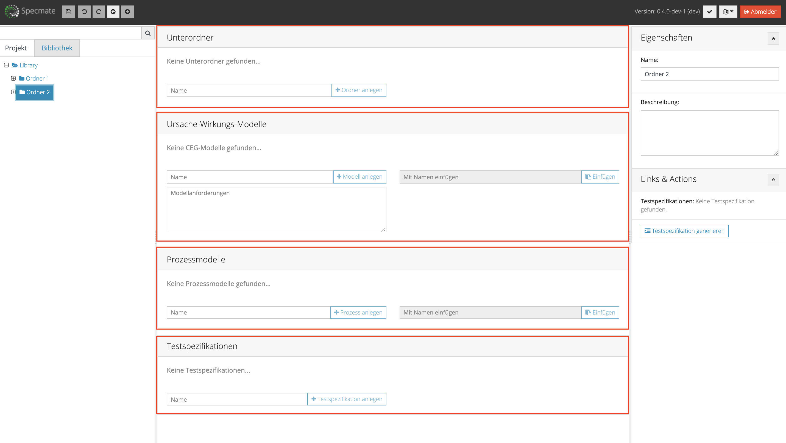

# Installation, configuration and commissioning

## Installation

* Make sure that Java 1.8 is installed. If not, get a Java 1.8 release, e.g. from [here](https://www.oracle.com/technetwork/java/javase/downloads/jdk8-downloads-2133151.html). To find out which Java version you are currently using, type 'java -version' in your console.
* Get the latest version of Specmate from the download page. Where and how to download the file, see the next section *Configuration*.
* Run `java -jar prod-specmate-all.jar --configurationFile /path/to/config/file` in your console.
* We recommend that you use  "Google Chrome" as your browser for Specmate, as Specmate works best with Chrome, thus minimizing the probability of display errors. [Here](https://www.google.com/intl/de_de/chrome/) you can download Chrome. If you are using a browser version that is too old, Specmate will display a warning.

## Configuration
Specmate is configured via the file *specmate-config.properties*. A sample configuration file is available [here](https://github.com/junkerm/specmate/blob/develop/bundles/specmate-config/config/specmate-config.properties).
Copy the displayed code into a text editor and save the file with the extension *.properties*. This gives you access to the latest version of Specmate.


## How to start

Specmate is a web-based tool. To start Specmate open your console and enter the following:
```properties
java -jar specmate.jar --configurationFile [path to your-config-file]
```

Now you can open your browser and navigate to http://localhost:8080 to access the Specmate homepage.


## Login


After starting Specmate, the login page is displayed. Please enter a user name, password and Specmate project. You do not need a dedicated login to use Specmate. Instead, you can use the login data of the request source connected to the Specmate project. For example, for the Specmate project ppm, the associated requirement source ***(From here on, the whole thing would have to be formulated generally and not Alliance-specific)*** is the Allianz HP PPM tool. Therefore you can log in with your PPM username and password.


# Overview usage and methodology

Specmate supports you designing your tests from your requirements. Specmate imports your requirements from various sources (e.g. Atlassian JIRA or HP PPM). Once the requirements have been imported, you can describe the requirements in a lightweight model in a first step. Specmate supports cause-and-effect diagram (CEGs) and process diagrams (similar to an activity diagram).


CEGs are particularly suitable for the description of requirements in the form "If ... then ..." and thus e.g. for the description of business rules. Process diagrams are particularly suitable for the description of business processes and are therefore particularly suitable for end-to-end testing.


Specmate can be used in many ways and is designed for different target groups: You can use Specmate in a classic, sequential as well as in an agile development process. In addition, you can use Specmate to perform test designs for different test levels.

- Developers can use Specmate to break down requirements and describe the logic at component or class levels and derive component or unit tests from these.
- Technical testers can use Specmate to derive system tests (e.g. for testing web services) from requirements.
- Business analysts and product owners can use Specmate to derive acceptance tests from requirements.


## User interface

After logging in to Specmate your view will be the following


- On the left side you see the *project explorer*.
It displays the imported requirements in a tree structure. You can navigate through the tree (i.e. open the folders) and select a requirement.
- In the project explorer you can switch between the *project* view with the imported requirements and the *library* view. In the project view, only the requirements and the associated information are displayed, no new folders can be created.
- In the library you can freely add folders and models. Models can be created in both the project view and the library view.
- Above the project explorer there is a *search field*. After entering a search word (from the title of the requirement or the user story or the corresponding HP PPM/Jira-ID), the project explorer displays requirements and models that match the search word. Please note that the library is currently not included in the search. More about the search function can be found in the [Search](###search) section.
- In the upper part of the screen, directly next to the Specmate logo, you will find buttons for saving the currently open element, for navigation and for resetting the last action in a model editor. As soon as you are in the model editor, a validate button appears as the fifth button at this position. Clicking the validate button updates all changes and displays or cancels possible error messages under "errors & warnings" in the properties column on the right. If the process of saving or validating takes a moment, Specmate displays a circular loading bar.
- In the upper part of the screen on the right side you can see your current Specmate version. Next to it you can choose whether to show or hide the log, you can select the language you want to work with and log out.

When a requirement is selected in the *project view*, you will see the following view.


In this view, you can view all information about the requirements. Additionally, you can create related models or test specifications, or view previously created models or test specifications.

When a folder is selected in the *library* view, the following view is displayed



- In the first block you find details about the selected folder.
- Changing the structure of the library (e.g. adding/removing folders) can be done in this first block subfolders.
- The folder structure at the top level of the library is predefined in the project configuration and therefore cannot be changed in Specmate itself.
- You can create cause-and-effect diagrams or process models in the respective block.

### Search

- Specmate will only display matching search results if you have entered at least three characters in the search field.
- Only search results from the project you are logged in to will be displayed.
- Requirements or test procedures are displayed if the search term occurs as a prefix in the name, description or ID of the requirement or test procedure.
- Specmate also supports *Wildcard searches*, namely
	- the wildcard search with "\*": the search finds all terms that are created by replacing "\*" with none or more characters. The search term "sta\*rs" thus finds terms like "stairs" or the novel "Starship Troopers" and the search term "pi\*zza" finds the Italian dish as well as the Italian word for town square "piazza".
	- the single-character wildcard search with "?": the search will find the terms "test" and "text", for example, if you enter "te?t".
- However, the symbols "\*" and "?" cannot be used at the beginning of a search term.

# Create model

In the project view you can see all information about the request
and create related models or see already created models.

## How do you decide which model to create?

For the modeling of requirements you have to choose between
Cause-effect diagrams (CEG) and process models. Depending on whether the type of requirement...

- is rule-based ("If this and that, then the following... with the exception of ... then ...") or
- or is process based ("First the user enters A. Based on the input, the system enters either B or C. Then the system asks the user for D, then...").

You can select the appropriate modeling technique. In the case of modeling rule-based requirements, cause-and-effect diagrams are used, while process-based requirements can be represented with process models.

## Basic editor functions for CEGs and process models

### Editor functions in the CEG Editor

If you have decided to implement your requirements in a CEG model in the project view, you will be taken to the CEG Editor. Here Specmate provides you with various tools for modeling your CEGs.


On this picture you can see the buttons you have to use to

1. set one or more nodes.
2. arrange the nodes flush by clicking on the small structure tree (auto-layout)
3. to hide the auxiliary lines.
4. to maximize the editor field in the view.

#### 1. Node

Click on the text "Node" as shown in the image and drag the text "Node" into the editor field with the help of guides. The node (or variable) thus set now appears here as a rectangle in the modeling area.


You can also

- Rearrange nodes by drag and drop,
- Copy nodes by [Copy&Paste](#copy-and-paste),
- Resize nodes: Select a node with a mouse click. Small green squares appear at the edges of the node. If you move the mouse pointer over one of these squares, the cursor turns into a double arrow and you can now vary the size of the node as you like.
- Click on a free space in the editor to edit the properties of the entire model.

#### 2. Auto-Layout

By clicking on the small structure tree, you can have your nodes arranged horizontally or vertically by Specmate, as shown in the following picture:


You can also undo the auto layout by clicking the "undo button" (top left).

#### 3. Show and hide auxiliary lines (grid)

If you want to show or hide the guides (grid), click on the button in the upper right corner.

#### 4. Maximize and enlarge modeling area

If you want to maximize the modeling area, click on the buttons in the upper right corner. If you drag a node or connection into the modeling area that is no longer visible to you, the modeling area automatically expands; scroll bars appear to allow you to move horizontally and vertically through the model editor.

#### 5. Create connections

Move your cursor to the node you have already created: A gray bordered arrow appears inside your node. Now you can connect the node to another node by holding down the mouse button and dragging the connection from the first to the second node.

1.) Move your cursor over a node: A gray bordered arrow appears in the middle of the node; click on this arrow and hold down the mouse button while dragging the connection to another node.


2.) As you draw a connection, it is visualized as a red dashed line; finished connections are shown as black arrows. The output node also appears as a green-black dashed border during connection.


3.) By clicking on the green boxes on the border of the node, you can increase or decrease its size. By clicking on the node, when your cursor appears as a hand symbol, you can move nodes. The destination and the target size are also shown as green dotted lines.


#### 6. Marking
If you want to select multiple connections and/or nodes, e.g. because you want to copy a part of your model or save it in the library, hold down the control key (Windows) or Command key (OS) while clicking on the desired elements.

#### 7. Error message

For example, if your connection is erroneously negated, an error message is displayed directly on the connection. The following applies to all error messages visualized by a triangular framed exclamation mark: If you move your cursor over the symbol, the reason for the error message is displayed in a small window. Correct the error and then click on the validate button in the upper left corner to make the error message disappear.


#### 8. Delete

You can delete connections and nodes by pressing the delete key (Windows) or by pressing the command and delete keys (OS) simultaneously. Or you can right-click on the connection (Windows) and select "delete" in the pop-up that appears. For OS, click on the connection while holding down the control key: Now you can also select "delete" in the pop-up.

#### 9. Undo

If you press the usual key combination STR/CMD + Z on the keyboard, Specmate undoes the last action performed. Or click on the undo button in the top left-hand corner.

### Properties

On the right side of the editor you can edit the *properties*,
such as names or descriptions of the model and individual nodes and connections.

 {width=300px}


### Links & Actions

In the *Links & Actions* section you can view the description of the requirement for which you are currently creating a model. Links to previously generated test definitions are also displayed. Test definitions test procedures] can be exported here.

### Change history
***(where is this? does it still exist?)***
In the *Change History* section you can track which user made which changes to the editor.

### Errors & Warnings

If there are any errors in the created model, Specmate displays them in the *Errors & Warnings* section.

###  The process model editor and its functions

The process model editor works similarly to the CEG editor: Instead of selecting "nodes" in the upper left corner and dragging them into the modeling area, there are even more differentiated options for the tools: In the process model, an initial pact (+START) and an end point (+END) must be selected. The nodes in between are called steps here and can be dragged into the modeling area using the (+STEPS) tool. There is also the tool (+DECISION), which visualizes a splitting in the process. The auto-layout function can also be used in the Process Editor by clicking on the small structure tree.


As in the CEG editor, connections are created by moving the cursor over the respective node (this also applies to the start, end and the decision nodes); an arrow with a grey border appears in the node, which can be dragged to any node by clicking the mouse button as a connection. The only difference is that the connections that originate from a decision node differ in that a condition must be assigned to them in the right-hand properties column. In contrast to the CEG editor, the nodes can only be named in the properties column and not directly by clicking on a node.

### Traces

The *Traces* column shows all requests associated with the selected step. Traces are only displayed in process diagrams. You can also add requirements by searching for them in the search field. Both the ID and the name of the requirement can be searched. The displayed requirements can then be added to the selected step by clicking on them. Requirements that have already been added can be deleted by clicking on the adjacent red recycle bin icon.

### Copy and Paste

#### Copy from the editors

In all editors you have the possibility to copy the model or parts of it and paste it into other models or save it in a library folder. To do this, draw a rectangle around the desired area to be copied. Like here, for example:


Use 'ctrl + C' to copy the area. The copied model can be inserted again in the same or in other editors with 'ctrl + V' and be further edited.

#### Copying from the project or library view

You can also copy entire models by using, for example, the [Library View](#library),
click on the *copy* button of the desired model.

Now you can create a copy of the model in the library view or in the project view.

By default, the new model is called "*copy of [name of original model]*".
You can change this name in the input field: By clicking the *Insert* button, you add the copy of the model to the project.


## Cause-and-effect diagram (CEGs)


After opening the cause-and-effect editor, you will see a modeling area in the middle where you can create your CEG. To model a CEG, you can select a tool above the modeling area. By clicking *+Node* and holding down the mouse button, you can drag the node into the modeling space to create a new node. By default the name of the node is *variable* and the condition is set to "is present". What is meant by these terms is explained in the following sections. You can change the attributes of the selected node on the right side in the [*properties*](#Properties) section.

To connect two nodes, proceed as follows:
Move your cursor to the cause node you have already created: A gray bordered arrow appears inside your node. Now you can connect the node to another node that should represent the effect by dragging the connection from the first to the second node while holding down the mouse button.

When a connection is created and selected, you also have the option to negate the connection: To do this, simply click on the connection you want to negate and check "negate" in the properties column on the right side. Alternatively, you can right-click on the connection (Windows) or hold down the control key when clicking on the connection (OS): A pop-up appears where you can select the options "Delete" or "Negate". The connection then appears in the editor as a dotted line (arrow) whereas a normal connection is shown as an arrow with a solid line.

If you want to check whether your CEG model is correct, click on the validate button and see if anything is displayed in the properties column under the heading "Errors & Warnings". For example, an unnamed variable (node) is displayed as an error.


### Node

A node describes a cause or an effect. There are two basic types of nodes:

- Nodes that can only have two values/conditions. So all conditions, which you can answer with yes/no.

Example:

variable: *Driving licence available*; condition: *yes* or *no*
- Nodes, which can have more than two expressions/conditions. Example:
	- variable: *Region*
	- condition: *Europe, Africa, Asia, America...

If several nodes have the same variable name, this can lead to difficulties during test generation. In this case it is recommended to use the *actual-equal* operator. You will find more about this in chapter [Condition](#condition).

If you have selected a node in the editor, you have the possibility to change the *properties* of the node on the right side. The following properties can be edited:

#### Variable

Here you can change the name of the variable, i.e. the name of the cause or effect.

#### Condition

The condition that the variable can accept is set to *is present* by default.
To change the description of the condition, select the corresponding node and write the desired condition in the *condition* field.

If several nodes have the same variable name, you can avoid difficulties during test generation
by placing an '=' in front of the condition. This way Specmate knows that only one condition of the variable can be true.
For example, if there are several nodes with the variable name *Region*, you can use as condition for example *=Europe*. During the test generation, you should take care to ensure that of all nodes with the same
variable names and with the condition set "=", only one node is true at a time.

A proven procedure is to declare the variables always as positive statements
(e.g. *Doors locked: true* instead of *Doors not locked: not true*).
Other examples of states can be found in our [Tutorial](Tutorial).


<!--
Link to the tutorial
-->

#### Type (And/Or)

If a node has multiple incoming connections, you can change the *type* of the node. To do so, select the appropriate node and change the *type* of the node under *properties* on the right side. Depending on the type of the node, incoming connections can be defined as OR links or AND links. If the type of the node is set to AND, all predecessor nodes must
must already be fulfilled with a connection to the respective node,
so that the node is fulfilled.

Example of an AND relationship:


But if the type of the node is set to
- OR, only one single direct predecessor has to be fulfilled, so that the node is fulfilled. This OR is an *inclusive OR*, which means that both causes can be true for the node to be fulfilled. This should not be confused with an exclusive OR, where *exactly one* cause must be true for the node to be satisfied.

Example of an OR relationship:


##### Excursus: Exclusive Or

An *exclusive OR*, or *XOR*, indicates that *exactly one* cause must be true in order to have an effect. In English one recognizes such an exclusive or by the formulation "either... or... (but not both)".

In Specmate the Exclusive Or can be easily constructed: For example, if you have the statement "Either A, or B, then C", you can model this statement using two auxiliary variables D and E and [Negation](#Negate):


Thus the statement is rewritten to "If A and not B, or B and not A, then C".

### Connections

A connection describes a relationship between the two nodes it connects. The start node can be understood as cause and the end node as effect. If you have selected a connection in the editor, you will see
the possibility to change the *properties* of the connection.

The following properties can be edited:

#### Negate

*Negate* negates the connection between two nodes. This means that the effect occurs,
if the cause is not present, and the effect will not occur if the cause is present.

#### Description

You can add a *description* to any connection between two nodes. This can contribute to your own understanding or that of a colleague. You can also change the type of node in the properties column, as explained above.


Make sure that the node or connection whose properties you want to edit has been clicked before. You can see whether this is the case by the green-dashed border, as the previous illustration shows. If no individual component (node or connection) in the model is clicked, the properties column describes the properties of the entire model.

#### Validate

If you are creating or have created a CEG model or process model, you can see another button on the upper left side of the screen next to the Specmate logo: the *validate* button. When you click this button, the validation of your model is updated. If your model is correct, you will see "No warnings" in green letters under the heading *Errors and Warnings* in the *Properties* tab. If your model is faulty, the errors are listed here. In this case, you must correct the error(s) and click the *validate* button again. Clicking the *validate* button is also necessary to generate a test afterwards or at a later date.

 {width=500px}

Specmate displays the nodes differently depending on their position in the CEG model, as shown in the following figure:


## Equivalence class analysis

### Motivation and goal

It is often a problem to determine a selection of suitable value classes from a large number of possible value classes of variables (e.g. age of a person). By selecting a few value classes the tester decides not to test many situations. Therefore it is important that this selection is done very carefully. The selection of value classes should ideally cover as many situations as possible. For that matter the *equivalence class analysis* helps.

The goal of creating equivalence classes is to achieve a high error detection rate with the smallest possible number of test cases. The equivalence classes are therefore similar classes or objects with regard to input and output data. Each value of an equivalence class is therefore a suitable representative for all values of the equivalence class.

#### Example 1

Often equivalence classes can be clearly determined. A requirement could be for example

> A child may slide down the water slide if he or she is taller than 1.40m.

Here are the equivalence classes for the input variable *size*:

- Equivalence class 1: >1.40m
- Equivalence class 2: <= 1.40m

And for the output variable *slide*:

- Equivalence class 1: allowed
- Equivalence class 2: not allowed

The corresponding CEG model would then look like this:


In general:

> If a variable has *n* values, the model needs *n-1* nodes.

#### Example 2

The *Example 1* can be further developed to the following requirement:

> A child may slide down the water slide if it is taller than 1.40m. If it is between 1.20m and 1.40m tall,
it may slide in the company of an adult person.

Here are the equivalence classes for the input variable *size*:

- Equivalence class 1: >1.40m
- equivalence class 2: 1.20<size<= 1.40m
- Equivalence class 2: <1.20m

There is a second input variable here, namely *accompaying person*. Here are the equivalence classes:

- Equivalence class 1: *present*
- Equivalence class 2: *not present*

The output variable *slide* remains the same.

It is recommended to introduce an additional variable *transition time*, which occurs when the child is smaller than 1.40m, but not smaller than 1.20m. The corresponding CEG model then looks like this:


## Process Diagram

To create process models, first open the corresponding editor. With the [*step*](#Step) tool you can add an action to the model.
Each model must have a start node and at least one end node.

You add a decision node to the model by using the [*step*](#Step) tool.
Select [*decision*](#Decision).

To connect two elements, you must select the [*connect*](#connect) tool and the nodes you want to connect. For each connection you can set a condition that the previous node must fulfill. When using the decision node, you can specify the outgoing connection conditions that must be met to follow the specific connection in the model. When a node is selected, Specmate displays the properties of the node on the right side. You can also specify the expected result of this step in the Properties pane.

The following figure shows the process of an ATM,
which was modeled with the process model editor:


### Start/End

*Start* and *End* describe the start and end of the procedure. There can be only one start node in a Procedure, but several end nodes can be specified as end.

### Step

A *step* describes an action to be performed. If a step node is selected, you can change the *name* of the step, i.e. the action to be performed, add a *description* and specify the expected outcome of the step.

### Decision

A *decision* is a step that can have multiple outputs. When a decision node is selected, you can change the *name* of the decision, i.e. you change which decision must be made. You can also add a *description* of the node.

### Connection

A *connection* describes a transition from one node to another. A *step* can have only one exit, so only one outgoing connection. However, a *decision* can have several exits and therefore several outgoing connections. *Step* and *decision* can each have multiple incoming connections. If a *connection* is selected, you can specify the *condition* that the preceding node has accepted. You can also add a *description*.

### Validate

You can also check your process models with the *validate* button. When you click on this button, the validation of your model is updated. If your model is correct, you will see "No warnings" in green letters on the *properties* tab under the heading *Errors and Warnings*. If your model is faulty, the error is listed here. In this case, you must correct the error and click the *Validate* button again.

# Error messages

For all error messages that are visualized by a triangular framed exclamation mark in the model editor, the following applies: If you move your cursor over the symbol, the reason for the error message is displayed in a small window.

### 1st process models

If you receive an error message in the process model editor, check whether one of the following scenarios applies to you:

- No name was assigned to one of the model elements or the model.
- There is more or less than exactly one start node.
- There is no end node.
- There are nodes with no incoming connection(s) (except for the start node).
- There are nodes without outgoing connection(s) (except for the end node).
- There are no activity nodes.
- No conditions are specified for the outbound connections of a decision node.
- A start node has one or more inbound connections.
- A startup node has more than one outbound connection.
- An activity node has more than one outbound connection.
- An end node has one or more outgoing connections.
- A decision node has only one outgoing connection.
- There is one node with empty variable names.
- You have entered too long text in one of the fields.

If one or more of these scenarios apply to your process model, correct the error source and press the validate button.

### 2nd CEG models

If you receive an error message in the CEG model editor, check whether one of the following scenarios applies to you:

- No name was assigned to one of the model elements or the model.
- No condition(s) are specified for one or more nodes.
- There are nodes without incoming or outgoing connections.
- The model is empty and has no nodes.
- There are identical variable names for effect and cause nodes.
- There is a node with empty variable names.
- You have entered too long text in one of the fields.


If one or more of these scenarios apply to your process model, correct the error and press the *validate* button.

# Test specification

You have the possibility to create a test case specification manually or to generate it automatically from a model. The symbol of the specification in the project explorer shows you whether it is generated automatically or manually.

Automatically generated: 

Manually created: 

In the model editor, use the "Generate Test specification" option on the right side of the "Links & Actions" tab to generate a test definition from a model. Alternatively, you can also find the "Generate Test specification" option in the requirement overview in the list of models after the model name. Make sure that you have pressed the *Validate* button before, to avoid an error message.


The name of the test case specification is based on the date and time when the specification was created. You can change the name of the specification and add a description.

## Test specification from CEG models

The specification consists of several test cases, each test case having a specific configuration. A test case assigns a value to each variable. In certain test cases Specmate leaves the value of a variable free. If this is the case, the variable is not restricted to a certain value. Rules are used to create the specification in order to ensure an optimal ratio between test coverage and number of test cases. These rules refer to Liggesmeyer's rules and are explained in more detail in the section *Rules for creating test specifications*. This prevents the number of test cases from growing exponentially as the number of causes increases.

It may happen that inconsistent tests are generated which violate the so-called *Liggesmeyer's rules*. Or that the model is contradictory in some other way. For example, because the conditions of the variable are different because of the
[*=-Operators*](#condition) contradict. Specmate indicates inconsistent tests by highlighting these tests in red. In this case, check your model or adjust your test cases.
- If two or more CEG nodes have the same variable and the condition begins with the character "=", Specmate generates the test cases in such a way that for each test case exactly *one* of the nodes is true.

Example:
Node 1: Currency = EUR
Node 2: Currency = DOLLAR


The nodes located in the *Input* column are variables that represent the causes from the model. These are all nodes that have no incoming connections.
Below the *Output* column are the variables representing the effects, i.e. all nodes that have no outgoing connections. You can also manually add further input and output variables or delete existing ones.

You can also delete a test case by clicking on the trash icon of the respective test case. If you want to add Test Cases manually, you can press the *Create Test Case* button in the lower area. The order of the test cases can be changed by drag & drop.

### Rules for creating test specifications

- If the effect node is *true* and the type of input nodes is AND, there is only one combination of input nodes. Namely: all input nodes are *true*.
- If the effect node is *false* and the type of the input nodes is AND, only combinations are tested, where exactly one input node is *false* and all others are *true*.
- If the effect node is *true* and the type of the input nodes is OR, only combinations are tested where exactly one input node is *true* and all others are *false*.
- If the effect node is *false* and the type of the input nodes is OR, there is only one combination of input nodes. Namely: all input nodes are *false*.

## Test specification from process models

The specification consists of several test cases, each test case having a specific configuration. A Test Case assigns one of the available decisions to each decision node and sets that decision to *true* accordingly.
Rules are used to create the specification in order to ensure an optimal ratio between test coverage and number of test cases. Again, you can add more test cases or decisions or delete existing ones. You can move the order of the test cases by drag & drop.

# Test Procedure

You can create a test procedure from each test case. Here you can define all necessary steps for the respective test case. When modeling a CEG, the test procedure must be added manually. Creating a test case specification from a process diagram results in automatically created test procedures. Names and descriptions can be exported to ALM. You can add an additional step by pressing the *Create Test Step* button. At each step of the test procedure you can reference parameters from the created model. The parameters from the model can be set to a specific value in the parameter mapping. When the creation of a test procedure is complete, you can use the *Export Test Procedure* button on the right to export it to e.g. Jira XRay Cloud for further processing. Before you export a test procedure, it is essential that you save it first. If you do not save the test procedure on your own, Specmate will ask you if you want to save the test procedure before exporting - if you agree, you can continue the export, if you do not agree, the export will be aborted. You can also open and edit an existing test procedure by clicking on it in the Project Explorer or in the Requirement Overview.


# Export of test definitions and procedures

Specmate allows the export of test specifications and procedures in different ways and formats.

## Export of test definitions

Test specifications can be exported to Specmate in three formats:

- As CSV file
- As Java test envelopes
- As JavaScript test envelopes


If you choose to **export as CSV**, the exported test definition will look like this:


If you choose to **export as JAVA**, the exported test definition will look like this:


If you decide to use **Export as JavaScript**, the exported test specification will look like this:


To export a test definition, please navigate to the test definition in Specmate (e.g. via the [Requirement Overview](#traces)). On the right hand side in the section [Links & Actions](#links-actions) you will find the subsection for export. Click on the link for the desired export format and save the offered file on your computer.

## Export of test procedures

Specmate allows test procedures to be exported to HP ALM if export is enabled for the project. Currently the HP ALM export is only activated for the project "ppm".
To export a test procedure, navigate to the corresponding test procedure. On the right side in the *Links & Actions* section, there is a button *Export Test Procedure*. Selecting this button exports the current test procedure to HP ALM. You will receive a confirmation that the export was successful.
In HP ALM, the exported test procedure is then listed in the *Test Plan* section.
and there in the subfolder *Subject* -> *Sandbox* -> *Specmate*, or one of the direct platform subfolders.

# Library

The library is your "construction kit" for models. Here you can save models or parts of models that you use frequently. By [Copy and Paste](#copy-and-paste) you can copy these blocks and insert them into other models.


You can create as many folders, subfolders, sub-subfolders, etc. as you like in the library view and also delete them again. To do this, click on the buttons shown in the illustration above. In the same way you can create CEGs, process models and test specifications here

As described above, it is also possible to save parts of more complex models that are used more often.
